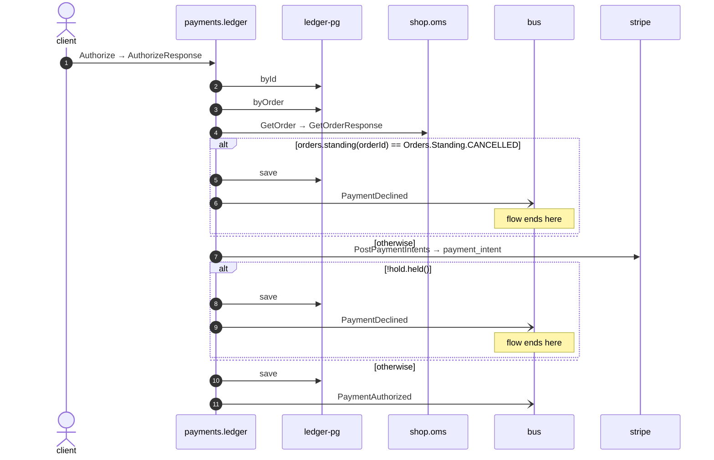

# Authorize

*Generated from the portolan catalog · commit `12 sources` · at 2026-09-05T13:47:23+07:00. Do not edit by hand.*

- **Id:** `flow.ledger-authorize`
- **Owner:** [payments](../payments/README.md)
- **Source:** [`examples/payments/ledger/src/main/java/org/portolan/payments/ledger/infrastructure/transport/grpc/payment/PaymentGrpcService.java`](https://github.com/shortlink-org/portolan/blob/main/examples/payments/ledger/src/main/java/org/portolan/payments/ledger/infrastructure/transport/grpc/payment/PaymentGrpcService.java)

Asks the gateway to hold the money for an order, and records either that it agreed or that it refused.

## Participants

| Participant | Kind | Context |
| --- | --- | --- |
| `client` | actor | — |
| `payments.ledger` | service | [payments](../payments/README.md) |
| `ledger-pg` | store | [payments](../payments/README.md) |
| `shop.oms` | service | [shop](../shop/README.md) |
| `bus` | broker | — |
| `stripe` | external | — |

## Sequence

## Steps

1. **client** → **payments.ledger** — Authorize → AuthorizeResponse
   status: declared · [`examples/payments/ledger/src/main/java/org/portolan/payments/ledger/infrastructure/transport/grpc/payment/PaymentGrpcService.java:34`](https://github.com/shortlink-org/portolan/blob/main/examples/payments/ledger/src/main/java/org/portolan/payments/ledger/infrastructure/transport/grpc/payment/PaymentGrpcService.java#L34)

2. **payments.ledger** → **ledger-pg** — byId
   status: declared · [`examples/payments/ledger/src/main/java/org/portolan/payments/ledger/application/payment/usecase/AuthorizePayment.java:45`](https://github.com/shortlink-org/portolan/blob/main/examples/payments/ledger/src/main/java/org/portolan/payments/ledger/application/payment/usecase/AuthorizePayment.java#L45)

3. **payments.ledger** → **ledger-pg** — byOrder
   status: declared · [`examples/payments/ledger/src/main/java/org/portolan/payments/ledger/application/payment/usecase/AuthorizePayment.java:50`](https://github.com/shortlink-org/portolan/blob/main/examples/payments/ledger/src/main/java/org/portolan/payments/ledger/application/payment/usecase/AuthorizePayment.java#L50)

4. **payments.ledger** → **shop.oms** — GetOrder → GetOrderResponse
   `shop.v1.OrderService/GetOrder` · status: declared · [`examples/payments/ledger/src/main/java/org/portolan/payments/ledger/application/payment/usecase/AuthorizePayment.java:54`](https://github.com/shortlink-org/portolan/blob/main/examples/payments/ledger/src/main/java/org/portolan/payments/ledger/application/payment/usecase/AuthorizePayment.java#L54)

> **One of**
>
> *orders.standing(orderId) == Orders.Standing.CANCELLED — *ends the flow**
>
> 
> 5. **payments.ledger** → **ledger-pg** — save
>    status: declared · [`examples/payments/ledger/src/main/java/org/portolan/payments/ledger/application/payment/usecase/AuthorizePayment.java:56`](https://github.com/shortlink-org/portolan/blob/main/examples/payments/ledger/src/main/java/org/portolan/payments/ledger/application/payment/usecase/AuthorizePayment.java#L56)
> 
> 6. **payments.ledger** → **bus** — PaymentDeclined
>    [`payments.ledger.payment.PaymentDeclined`](../payments/ledger/aggregates/payment.md#event-payments-ledger-payment-paymentdeclined) · status: declared · [`examples/payments/ledger/src/main/java/org/portolan/payments/ledger/application/payment/usecase/AuthorizePayment.java:57`](https://github.com/shortlink-org/portolan/blob/main/examples/payments/ledger/src/main/java/org/portolan/payments/ledger/application/payment/usecase/AuthorizePayment.java#L57)
>
> *otherwise*

7. **payments.ledger** → **stripe** — PostPaymentIntents → payment_intent
   `stripe.v1/PostPaymentIntents` · status: declared · [`examples/payments/ledger/src/main/java/org/portolan/payments/ledger/application/payment/usecase/AuthorizePayment.java:62`](https://github.com/shortlink-org/portolan/blob/main/examples/payments/ledger/src/main/java/org/portolan/payments/ledger/application/payment/usecase/AuthorizePayment.java#L62)

> **One of**
>
> *!hold.held() — *ends the flow**
>
> 
> 8. **payments.ledger** → **ledger-pg** — save
>    status: declared · [`examples/payments/ledger/src/main/java/org/portolan/payments/ledger/application/payment/usecase/AuthorizePayment.java:65`](https://github.com/shortlink-org/portolan/blob/main/examples/payments/ledger/src/main/java/org/portolan/payments/ledger/application/payment/usecase/AuthorizePayment.java#L65)
> 
> 9. **payments.ledger** → **bus** — PaymentDeclined
>    [`payments.ledger.payment.PaymentDeclined`](../payments/ledger/aggregates/payment.md#event-payments-ledger-payment-paymentdeclined) · status: declared · [`examples/payments/ledger/src/main/java/org/portolan/payments/ledger/application/payment/usecase/AuthorizePayment.java:66`](https://github.com/shortlink-org/portolan/blob/main/examples/payments/ledger/src/main/java/org/portolan/payments/ledger/application/payment/usecase/AuthorizePayment.java#L66)
>
> *otherwise*

10. **payments.ledger** → **ledger-pg** — save
   status: declared · [`examples/payments/ledger/src/main/java/org/portolan/payments/ledger/application/payment/usecase/AuthorizePayment.java:70`](https://github.com/shortlink-org/portolan/blob/main/examples/payments/ledger/src/main/java/org/portolan/payments/ledger/application/payment/usecase/AuthorizePayment.java#L70)

11. **payments.ledger** → **bus** — PaymentAuthorized
   [`payments.ledger.payment.PaymentAuthorized`](../payments/ledger/aggregates/payment.md#event-payments-ledger-payment-paymentauthorized) · status: declared · [`examples/payments/ledger/src/main/java/org/portolan/payments/ledger/application/payment/usecase/AuthorizePayment.java:71`](https://github.com/shortlink-org/portolan/blob/main/examples/payments/ledger/src/main/java/org/portolan/payments/ledger/application/payment/usecase/AuthorizePayment.java#L71)
