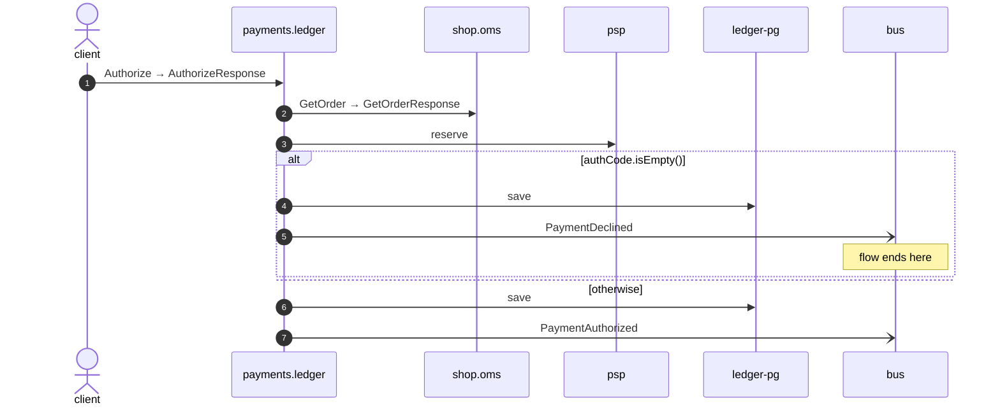

# Authorize

*Generated from the portolan catalog · commit `4 sources` · at 2026-09-05T03:58:04Z. Do not edit by hand.*

- **Id:** `flow.ledger-authorize`
- **Owner:** [payments](../payments/README.md)
- **Source:** `examples/payments/ledger/src/main/java/org/portolan/payments/ledger/infrastructure/transport/grpc/payment/PaymentGrpcService.java`

Asks the gateway to hold the money for an order, and records either that it agreed or that it refused.

## Participants

| Participant | Kind | Context | Label |
| --- | --- | --- | --- |
| `client` | actor | — | — |
| `payments.ledger` | service | [payments](../payments/README.md) | — |
| `shop.oms` | service | [shop](../shop/README.md) | — |
| `psp` | unknown | — | psp |
| `ledger-pg` | store | [payments](../payments/README.md) | — |
| `bus` | broker | — | — |

## Sequence

## Steps

1. **client** → **payments.ledger** — Authorize → AuthorizeResponse
   status: declared · `examples/payments/ledger/src/main/java/org/portolan/payments/ledger/infrastructure/transport/grpc/payment/PaymentGrpcService.java:33`
2. **payments.ledger** → **shop.oms** — GetOrder → GetOrderResponse
   `shop.v1.OrderService/GetOrder` · status: declared · `examples/payments/ledger/src/main/java/org/portolan/payments/ledger/application/payment/usecase/AuthorizePayment.java:37`
3. **payments.ledger** → **psp** — reserve
   status: unresolved · `examples/payments/ledger/src/main/java/org/portolan/payments/ledger/application/payment/usecase/AuthorizePayment.java:39`

> **One of**
>
> *authCode.isEmpty() — *ends the flow**
>
> 4. **payments.ledger** → **ledger-pg** — save
>    status: declared · `examples/payments/ledger/src/main/java/org/portolan/payments/ledger/application/payment/usecase/AuthorizePayment.java:43`
> 5. **payments.ledger** → **bus** — PaymentDeclined
>    [payments.ledger.payment.PaymentDeclined](../payments/ledger/aggregates/payment.md) · status: declared · `examples/payments/ledger/src/main/java/org/portolan/payments/ledger/application/payment/usecase/AuthorizePayment.java:44`
>
> *otherwise*

6. **payments.ledger** → **ledger-pg** — save
   status: declared · `examples/payments/ledger/src/main/java/org/portolan/payments/ledger/application/payment/usecase/AuthorizePayment.java:49`
7. **payments.ledger** → **bus** — PaymentAuthorized
   [payments.ledger.payment.PaymentAuthorized](../payments/ledger/aggregates/payment.md) · status: declared · `examples/payments/ledger/src/main/java/org/portolan/payments/ledger/application/payment/usecase/AuthorizePayment.java:50`
