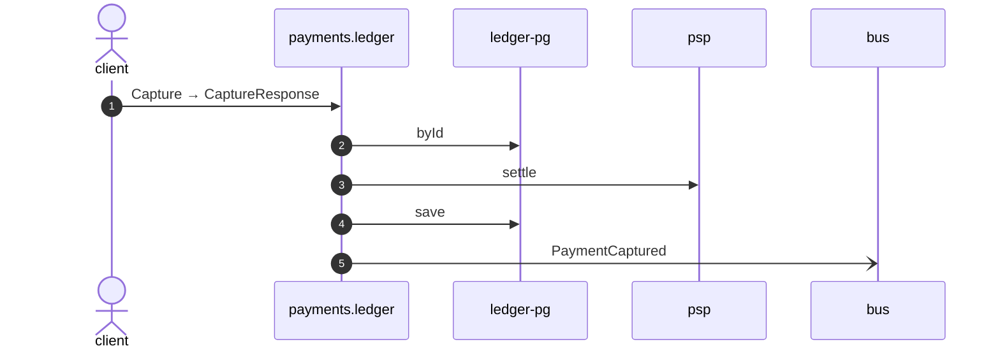

# Capture

*Generated from the portolan catalog · commit `9 sources` · at 2026-09-05T03:14:52+07:00. Do not edit by hand.*

- **Id:** `flow.ledger-capture`
- **Owner:** [payments](../payments/README.md)
- **Source:** `examples/payments/ledger/src/main/java/org/portolan/payments/ledger/infrastructure/transport/grpc/payment/PaymentGrpcService.java`

Moves the money the gateway was holding, writes the pair of postings for it, and says so on the bus.

## Participants

| Participant | Kind | Context | Label |
| --- | --- | --- | --- |
| `client` | actor | — | — |
| `payments.ledger` | service | [payments](../payments/README.md) | — |
| `ledger-pg` | store | [payments](../payments/README.md) | — |
| `psp` | unknown | — | psp |
| `bus` | broker | — | — |

## Sequence

## Steps

1. **client** → **payments.ledger** — Capture → CaptureResponse
   status: declared · `examples/payments/ledger/src/main/java/org/portolan/payments/ledger/infrastructure/transport/grpc/payment/PaymentGrpcService.java:48`
2. **payments.ledger** → **ledger-pg** — byId
   status: declared · `examples/payments/ledger/src/main/java/org/portolan/payments/ledger/application/payment/usecase/CapturePayment.java:32`
3. **payments.ledger** → **psp** — settle
   status: unresolved · `examples/payments/ledger/src/main/java/org/portolan/payments/ledger/application/payment/usecase/CapturePayment.java:33`
4. **payments.ledger** → **ledger-pg** — save
   status: declared · `examples/payments/ledger/src/main/java/org/portolan/payments/ledger/application/payment/usecase/CapturePayment.java:35`
5. **payments.ledger** → **bus** — PaymentCaptured
   [payments.ledger.payment.PaymentCaptured](../payments/ledger/aggregates/payment.md) · status: declared · `examples/payments/ledger/src/main/java/org/portolan/payments/ledger/application/payment/usecase/CapturePayment.java:36`
