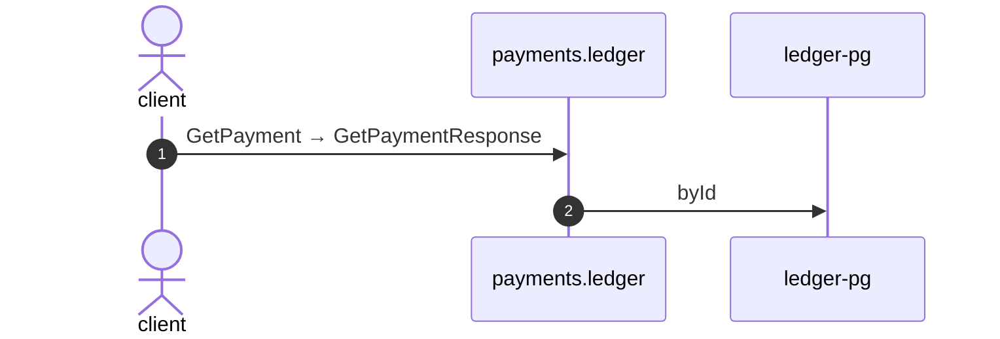

# Get payment

*Generated from the portolan catalog · commit `8 sources` · at 2026-08-29T09:14:22Z. Do not edit by hand.*

- **Id:** `flow.ledger-get-payment`
- **Owner:** [payments](../payments/README.md)
- **Source:** `examples/payments/ledger/src/main/java/org/portolan/payments/ledger/infrastructure/transport/grpc/payment/PaymentGrpcService.java`

Reads one payment, for whoever is asking what happened to the money.

## Participants

| Participant | Kind | Context |
| --- | --- | --- |
| `client` | actor | — |
| `payments.ledger` | service | [payments](../payments/README.md) |
| `ledger-pg` | store | [payments](../payments/README.md) |

## Sequence

## Steps

1. **client** → **payments.ledger** — GetPayment → GetPaymentResponse
   status: declared · `examples/payments/ledger/src/main/java/org/portolan/payments/ledger/infrastructure/transport/grpc/payment/PaymentGrpcService.java:59`
2. **payments.ledger** → **ledger-pg** — byId
   status: declared · `examples/payments/ledger/src/main/java/org/portolan/payments/ledger/application/payment/usecase/GetPayment.java:20`
