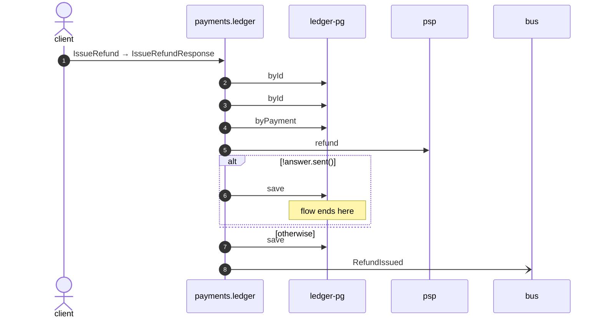

# Issue refund

*Generated from the portolan catalog · commit `6 sources` · at 2026-09-05T03:58:04Z. Do not edit by hand.*

- **Id:** `flow.ledger-issue-refund`
- **Owner:** [payments](../payments/README.md)
- **Source:** `examples/payments/ledger/src/main/java/org/portolan/payments/ledger/infrastructure/transport/grpc/refund/RefundGrpcService.java`

Sends money back against a captured payment, in full or in part.

## Participants

| Participant | Kind | Context | Label |
| --- | --- | --- | --- |
| `client` | actor | — | — |
| `payments.ledger` | service | [payments](../payments/README.md) | — |
| `ledger-pg` | store | [payments](../payments/README.md) | — |
| `psp` | unknown | — | psp |
| `bus` | broker | — | — |

## Sequence

## Steps

1. **client** → **payments.ledger** — IssueRefund → IssueRefundResponse
   status: declared · `examples/payments/ledger/src/main/java/org/portolan/payments/ledger/infrastructure/transport/grpc/refund/RefundGrpcService.java:29`
2. **payments.ledger** → **ledger-pg** — byId
   status: declared · `examples/payments/ledger/src/main/java/org/portolan/payments/ledger/application/refund/usecase/IssueRefund.java:47`
3. **payments.ledger** → **ledger-pg** — byId
   status: declared · `examples/payments/ledger/src/main/java/org/portolan/payments/ledger/application/refund/usecase/IssueRefund.java:52`
4. **payments.ledger** → **ledger-pg** — byPayment
   status: declared · `examples/payments/ledger/src/main/java/org/portolan/payments/ledger/application/refund/usecase/IssueRefund.java:56`
5. **payments.ledger** → **psp** — refund
   status: unresolved · `examples/payments/ledger/src/main/java/org/portolan/payments/ledger/application/refund/usecase/IssueRefund.java:62`

> **One of**
>
> *!answer.sent() — *ends the flow**
>
> 6. **payments.ledger** → **ledger-pg** — save
>    status: declared · `examples/payments/ledger/src/main/java/org/portolan/payments/ledger/application/refund/usecase/IssueRefund.java:65`
>
> *otherwise*

7. **payments.ledger** → **ledger-pg** — save
   status: declared · `examples/payments/ledger/src/main/java/org/portolan/payments/ledger/application/refund/usecase/IssueRefund.java:69`
8. **payments.ledger** → **bus** — RefundIssued
   [payments.ledger.refund.RefundIssued](../payments/ledger/aggregates/refund.md) · status: declared · `examples/payments/ledger/src/main/java/org/portolan/payments/ledger/application/refund/usecase/IssueRefund.java:70`
