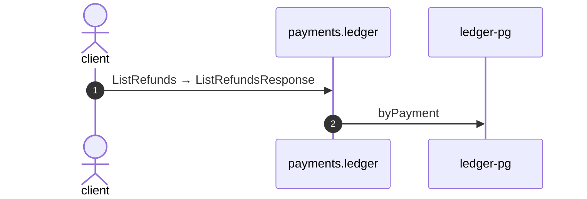

# List refunds

*Generated from the portolan catalog · commit `10 sources` · at 2026-09-05T03:58:04Z. Do not edit by hand.*

- **Id:** `flow.ledger-list-refunds`
- **Owner:** [payments](../payments/README.md)
- **Source:** [`examples/payments/ledger/src/main/java/org/portolan/payments/ledger/infrastructure/transport/grpc/refund/RefundGrpcService.java`](https://github.com/shortlink-org/portolan/blob/main/examples/payments/ledger/src/main/java/org/portolan/payments/ledger/infrastructure/transport/grpc/refund/RefundGrpcService.java)

Every refund against one payment, newest first.

## Participants

| Participant | Kind | Context |
| --- | --- | --- |
| `client` | actor | — |
| `payments.ledger` | service | [payments](../payments/README.md) |
| `ledger-pg` | store | [payments](../payments/README.md) |

## Sequence

## Steps

1. **client** → **payments.ledger** — ListRefunds → ListRefundsResponse
   status: declared · [`examples/payments/ledger/src/main/java/org/portolan/payments/ledger/infrastructure/transport/grpc/refund/RefundGrpcService.java:48`](https://github.com/shortlink-org/portolan/blob/main/examples/payments/ledger/src/main/java/org/portolan/payments/ledger/infrastructure/transport/grpc/refund/RefundGrpcService.java#L48)

2. **payments.ledger** → **ledger-pg** — byPayment
   status: declared · [`examples/payments/ledger/src/main/java/org/portolan/payments/ledger/application/refund/usecase/ListRefunds.java:27`](https://github.com/shortlink-org/portolan/blob/main/examples/payments/ledger/src/main/java/org/portolan/payments/ledger/application/refund/usecase/ListRefunds.java#L27)
