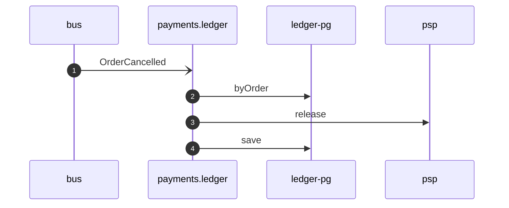

# Void payment on order cancelled

*Generated from the portolan catalog · commit `8 sources` · at 2026-09-05T03:14:52+07:00. Do not edit by hand.*

- **Id:** `flow.ledger-void-payment-on-order-cancelled`
- **Owner:** [payments](../payments/README.md)
- **Source:** `examples/payments/ledger/src/main/java/org/portolan/payments/ledger/application/policy/VoidPaymentOnOrderCancelled.java`

Gives back what was held once the order it was held for is gone.

## Participants

| Participant | Kind | Context | Label |
| --- | --- | --- | --- |
| `bus` | broker | — | — |
| `payments.ledger` | service | [payments](../payments/README.md) | — |
| `ledger-pg` | store | [payments](../payments/README.md) | — |
| `psp` | unknown | — | psp |

## Sequence

## Steps

1. **bus** → **payments.ledger** — OrderCancelled
   [shop.oms.order.OrderCancelled](../shop/oms/aggregates/order.md) · status: declared · `examples/payments/ledger/src/main/java/org/portolan/payments/ledger/application/policy/VoidPaymentOnOrderCancelled.java:25`
2. **payments.ledger** → **ledger-pg** — byOrder
   status: declared · `examples/payments/ledger/src/main/java/org/portolan/payments/ledger/application/policy/VoidPaymentOnOrderCancelled.java:27`
3. **payments.ledger** → **psp** — release
   status: unresolved · `examples/payments/ledger/src/main/java/org/portolan/payments/ledger/application/policy/VoidPaymentOnOrderCancelled.java:28`
4. **payments.ledger** → **ledger-pg** — save
   status: declared · `examples/payments/ledger/src/main/java/org/portolan/payments/ledger/application/policy/VoidPaymentOnOrderCancelled.java:30`
