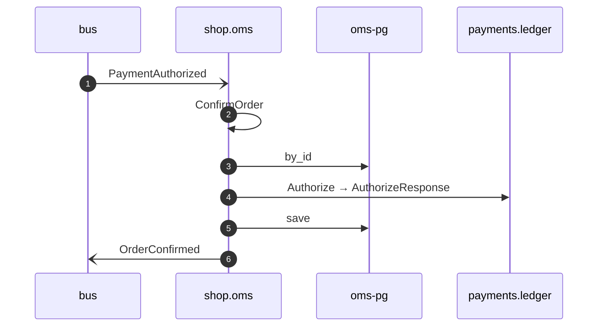

# Confirm order on payment authorized

*Generated from the portolan catalog · commit `9 sources` · at 2026-09-05T03:58:04Z. Do not edit by hand.*

- **Id:** `flow.oms-confirm-order-on-payment-authorized`
- **Owner:** [shop](../shop/README.md)
- **Source:** [`examples/shop/oms/src/application/policy/confirm_order_on_payment_authorized.rs`](https://github.com/shortlink-org/portolan/blob/main/examples/shop/oms/src/application/policy/confirm_order_on_payment_authorized.rs)

Confirms the order once the payment for it is authorised (ADR oms.0005). The publisher is `payments.ledger`, and the name is the one it puts on the message: every service on this bus names its events after itself.

## Participants

| Participant | Kind | Context |
| --- | --- | --- |
| `bus` | broker | — |
| `shop.oms` | service | [shop](../shop/README.md) |
| `oms-pg` | store | [shop](../shop/README.md) |
| `payments.ledger` | service | [payments](../payments/README.md) |

## Sequence

## Steps

1. **bus** → **shop.oms** — PaymentAuthorized
   [`payments.ledger.payment.PaymentAuthorized`](../payments/ledger/aggregates/payment.md#event-payments-ledger-payment-paymentauthorized) · status: declared · [`examples/shop/oms/src/application/policy/confirm_order_on_payment_authorized.rs:20`](https://github.com/shortlink-org/portolan/blob/main/examples/shop/oms/src/application/policy/confirm_order_on_payment_authorized.rs#L20) · Reacts to the message named `ledger.PaymentAuthorized`, which is not an event this repository declares.

2. **shop.oms** ↺ **shop.oms** — ConfirmOrder
   status: declared · [`examples/shop/oms/src/application/policy/confirm_order_on_payment_authorized.rs:27`](https://github.com/shortlink-org/portolan/blob/main/examples/shop/oms/src/application/policy/confirm_order_on_payment_authorized.rs#L27)

3. **shop.oms** → **oms-pg** — by_id
   status: declared · [`examples/shop/oms/src/application/order/usecases/confirm_order/mod.rs:31`](https://github.com/shortlink-org/portolan/blob/main/examples/shop/oms/src/application/order/usecases/confirm_order/mod.rs#L31)

4. **shop.oms** → **payments.ledger** — Authorize → AuthorizeResponse
   `payments.v1.PaymentService/Authorize` · status: declared · [`examples/shop/oms/src/application/order/usecases/confirm_order/mod.rs:32`](https://github.com/shortlink-org/portolan/blob/main/examples/shop/oms/src/application/order/usecases/confirm_order/mod.rs#L32)

5. **shop.oms** → **oms-pg** — save
   status: declared · [`examples/shop/oms/src/application/order/usecases/confirm_order/mod.rs:34`](https://github.com/shortlink-org/portolan/blob/main/examples/shop/oms/src/application/order/usecases/confirm_order/mod.rs#L34)

6. **shop.oms** → **bus** — OrderConfirmed
   [`shop.oms.order.OrderConfirmed`](../shop/oms/aggregates/order.md#event-shop-oms-order-orderconfirmed) · status: declared · [`examples/shop/oms/src/application/order/usecases/confirm_order/mod.rs:34`](https://github.com/shortlink-org/portolan/blob/main/examples/shop/oms/src/application/order/usecases/confirm_order/mod.rs#L34)
