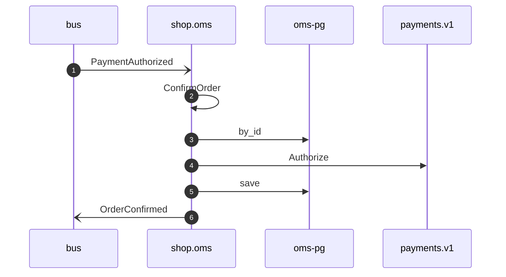

# Confirm order on payment authorized

*Generated from the portolan catalog · commit `6 sources` · at 2026-08-29T09:14:22Z. Do not edit by hand.*

- **Id:** `flow.oms-confirm-order-on-payment-authorized`
- **Owner:** [shop](../shop/README.md)
- **Source:** `examples/shop/oms/src/application/policy/confirm_order_on_payment_authorized.rs`

Confirms the order once the payment for it is authorised (ADR oms.0005). Declared ahead of its publisher: nothing in the estate says `payments.PaymentAuthorized` yet, and the catalog says so.

## Participants

| Participant | Kind | Context | Label |
| --- | --- | --- | --- |
| `bus` | broker | — | — |
| `shop.oms` | service | [shop](../shop/README.md) | — |
| `oms-pg` | store | [shop](../shop/README.md) | — |
| `payments-v1` | unknown | — | payments.v1 |

## Sequence

## Steps

1. **bus** → **shop.oms** — PaymentAuthorized
   status: unresolved · `examples/shop/oms/src/application/policy/confirm_order_on_payment_authorized.rs:20` · Reacts to the message named `payments.PaymentAuthorized`, which is not an event this repository declares.
2. **shop.oms** ↺ **shop.oms** — ConfirmOrder
   status: declared · `examples/shop/oms/src/application/policy/confirm_order_on_payment_authorized.rs:27`
3. **shop.oms** → **oms-pg** — by_id
   status: declared · `examples/shop/oms/src/application/order/usecases/confirm_order/mod.rs:31`
4. **shop.oms** → **payments-v1** — Authorize
   `payments.v1.PaymentService/Authorize` · status: unresolved · `examples/shop/oms/src/application/order/usecases/confirm_order/mod.rs:32`
5. **shop.oms** → **oms-pg** — save
   status: declared · `examples/shop/oms/src/application/order/usecases/confirm_order/mod.rs:34`
6. **shop.oms** → **bus** — OrderConfirmed
   [shop.oms.order.OrderConfirmed](../shop/oms/aggregates/order.md) · status: declared · `examples/shop/oms/src/application/order/usecases/confirm_order/mod.rs:34`
