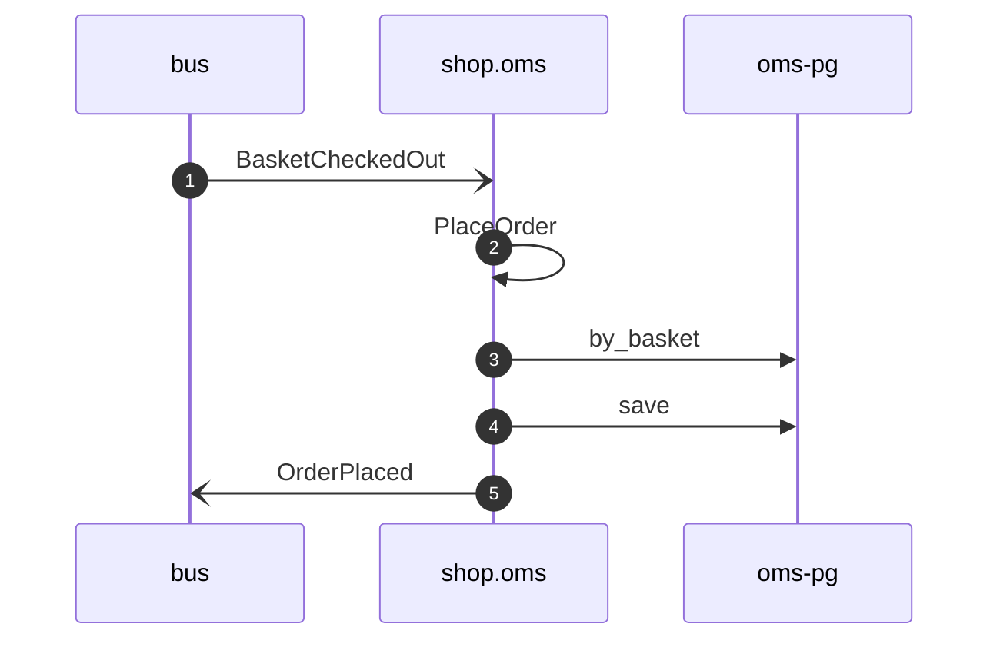

# Place order on basket checked out

*Generated from the portolan catalog · commit `7 sources` · at 2026-09-05T03:14:52+07:00. Do not edit by hand.*

- **Id:** `flow.oms-place-order-on-basket-checked-out`
- **Owner:** [shop](../shop/README.md)
- **Source:** `examples/shop/oms/src/application/policy/place_order_on_basket_checked_out.rs`

Places the order the basket was checked out for (ADR oms.0002). The order takes the basket's id, so the same checkout heard twice places one order.

## Participants

| Participant | Kind | Context |
| --- | --- | --- |
| `bus` | broker | — |
| `shop.oms` | service | [shop](../shop/README.md) |
| `oms-pg` | store | [shop](../shop/README.md) |

## Sequence

## Steps

1. **bus** → **shop.oms** — BasketCheckedOut
   [shop.cart.basket.BasketCheckedOut](../shop/cart/aggregates/basket.md) · `examples/shop/oms/src/application/policy/place_order_on_basket_checked_out.rs:19` · Seen running in telemetry/traces.jsonl (1 trace).
2. **shop.oms** ↺ **shop.oms** — PlaceOrder
   status: declared · `examples/shop/oms/src/application/policy/place_order_on_basket_checked_out.rs:29`
3. **shop.oms** → **oms-pg** — by_basket
   status: declared · `examples/shop/oms/src/application/order/usecases/place_order/mod.rs:27`
4. **shop.oms** → **oms-pg** — save
   status: declared · `examples/shop/oms/src/application/order/usecases/place_order/mod.rs:31`
5. **shop.oms** → **bus** — OrderPlaced
   [shop.oms.order.OrderPlaced](../shop/oms/aggregates/order.md) · `examples/shop/oms/src/application/order/usecases/place_order/mod.rs:31` · Seen running in telemetry/traces.jsonl (1 trace).
