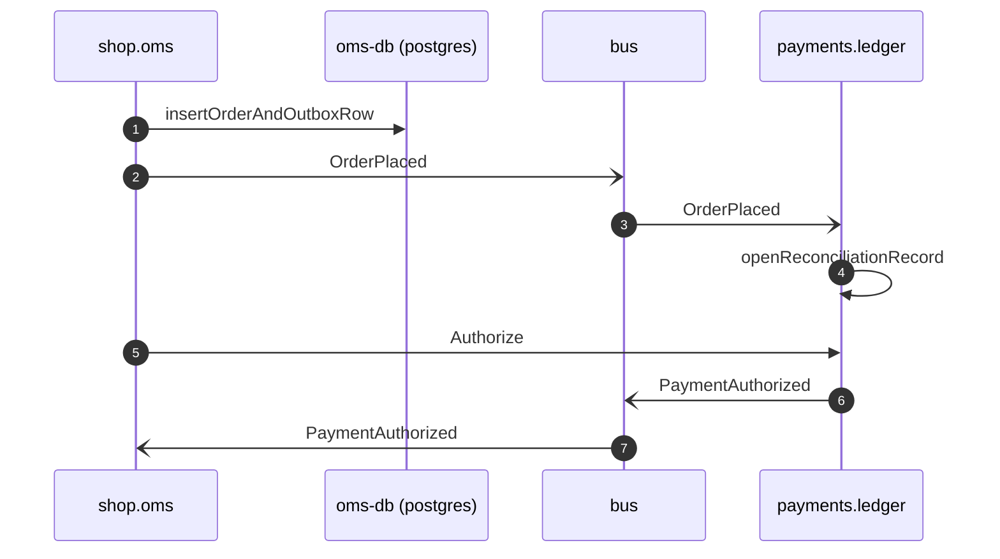

# Order accepted

*Generated from the portolan catalog · commit `5 sources` · at 2026-08-29T09:14:22Z. Do not edit by hand.*

- **Id:** `flow.order-accepted`
- **Owner:** [shop](../shop/README.md)
- **Source:** `services/oms/test/integration/order_accepted_test.go`

The narrow slice one integration test pins end to end: an order commits with its outbox row, the relay publishes it, the ledger picks it up and the authorization comes back. Every hop here is asserted, which is why this is the only flow with no gaps in it.

## Participants

| Participant | Kind | Context | Label |
| --- | --- | --- | --- |
| `shop.oms` | service | [shop](../shop/README.md) | — |
| `oms-db` | store | [shop](../shop/README.md) | oms-db (postgres) |
| `bus` | broker | — | — |
| `payments.ledger` | service | [payments](../payments/README.md) | — |

## Sequence

## Steps

1. **shop.oms** → **oms-db** — insertOrderAndOutboxRow
   `internal/oms/adapter/postgres/order_repo.go:141` · The order row and the OrderPlaced outbox row commit in one transaction, so the event cannot be published before the order exists or lost after it does.
2. **shop.oms** → **bus** — OrderPlaced
   [shop.oms.order.OrderPlaced](../shop/oms/aggregates/order.md) · `order_accepted_test.go:58` · Published by the outbox relay, not by the request handler. The test waits on the relay rather than on PlaceOrder returning.
3. **bus** → **payments.ledger** — OrderPlaced
   [shop.oms.order.OrderPlaced](../shop/oms/aggregates/order.md) · `order_accepted_test.go:71` · Consumer group `ledger-orders`, at-least-once. The test replays the same message a second time and asserts nothing changes.
4. **payments.ledger** ↺ **payments.ledger** — openReconciliationRecord
   `internal/ledger/app/intent.go:47` · The event only opens the record the gateway webhook later matches against. Authorizing is the synchronous call below, because checkout needs the answer before it can confirm.
5. **shop.oms** → **payments.ledger** — Authorize
   `payments.v1.Payments/Authorize` · `order_accepted_test.go:88` · Carries the order's idempotency key. The gateway behind the ledger is the sandbox stub here; the real hop out of the estate is drawn in the checkout flow.
6. **payments.ledger** → **bus** — PaymentAuthorized
   [payments.ledger.payment.PaymentAuthorized](../payments/ledger/aggregates/payment.md) · `order_accepted_test.go:103`
7. **bus** → **shop.oms** — PaymentAuthorized
   [payments.ledger.payment.PaymentAuthorized](../payments/ledger/aggregates/payment.md) · `order_accepted_test.go:114`
