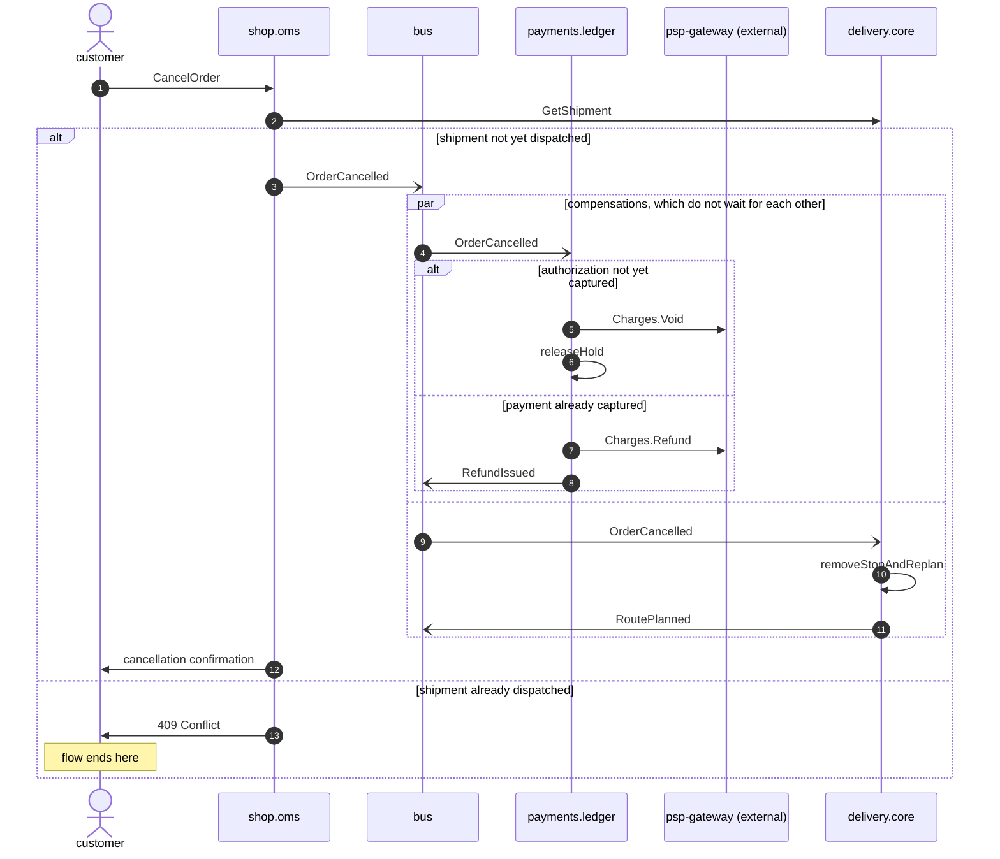

# Order cancelled

*Generated from the portolan catalog · commit `3 sources` · at 2026-08-29T09:14:22Z. Do not edit by hand.*

- **Id:** `flow.order-cancelled`
- **Owner:** [shop](../shop/README.md)
- **Source:** `services/oms/test/e2e/cancel_test.go`

A customer cancels before the parcel moves, and two compensations run side by side: the money is unwound at the gateway, and the stop is taken off the route. Whether the money is voided or refunded depends on how far payment got, and the delivery half is declared everywhere and observed nowhere.

## Participants

| Participant | Kind | Context | Label |
| --- | --- | --- | --- |
| `customer` | actor | — | — |
| `shop.oms` | service | [shop](../shop/README.md) | — |
| `bus` | broker | — | — |
| `payments.ledger` | service | [payments](../payments/README.md) | — |
| `psp-gateway` | external | — | psp-gateway (external) |
| `delivery.core` | service | [delivery](../delivery/README.md) | — |

## Sequence

## Steps

1. **customer** → **shop.oms** — CancelOrder
   `cancel_test.go:44`
2. **shop.oms** → **delivery.core** — GetShipment
   `delivery.v1.Delivery/GetShipment` · status: declared · `internal/oms/client/delivery.go:41` · Cancelling is only allowed while the shipment is `held` or `planned`. The state comes from delivery, not from the order, so a stale read here is what lets a dispatched parcel be cancelled.

> **One of**
>
> *shipment not yet dispatched*
>
> 3. **shop.oms** → **bus** — OrderCancelled
>    [shop.oms.order.OrderCancelled](../shop/oms/aggregates/order.md) · `cancel_test.go:61`
>
> > **In parallel** — compensations, which do not wait for each other
> >
> > *Branch 1*
> >
> > 4. **bus** → **payments.ledger** — OrderCancelled
> >    [shop.oms.order.OrderCancelled](../shop/oms/aggregates/order.md) · `cancel_test.go:70`
> >
> > > **One of**
> > >
> > > *authorization not yet captured*
> > >
> > > 5. **payments.ledger** → **psp-gateway** — Charges.Void
> > >    `psp.v2.Charges/Void` · status: unresolved · `internal/ledger/adapter/psp/client.go:171` · Voiding costs nothing and leaves no trace on the customer's statement, which is why the capture is held back until dispatch in the first place.
> > > 6. **payments.ledger** ↺ **payments.ledger** — releaseHold
> > >    `cancel_test.go:83`
> > >
> > > *payment already captured*
> > >
> > > 7. **payments.ledger** → **psp-gateway** — Charges.Refund
> > >    `psp.v2.Charges/Refund` · status: unresolved · `internal/ledger/adapter/psp/client.go:138`
> > > 8. **payments.ledger** → **bus** — RefundIssued
> > >    [payments.ledger.refund.RefundIssued](../payments/ledger/aggregates/refund.md) · status: declared · `internal/ledger/app/refund.go:88` · The same event the support refund publishes. Nothing in the payload says which of the two happened, so a consumer cannot tell a cancelled order from a returned one.
> >
> >
> > *Branch 2*
> >
> > 9. **bus** → **delivery.core** — OrderCancelled
> >    [shop.oms.order.OrderCancelled](../shop/oms/aggregates/order.md) · status: declared · `internal/delivery/app/subscribe.go:62` · The subscription is registered in the delivery repo, but no test covers it and no trace in the sampled window shows it firing.
> > 10. **delivery.core** ↺ **delivery.core** — removeStopAndReplan
> >    status: declared · `internal/delivery/app/route.go:112`
> > 11. **delivery.core** → **bus** — RoutePlanned
> >    [delivery.core.route.RoutePlanned](../delivery/core/aggregates/route.md) · status: declared · `internal/delivery/app/route.go:94` · The route is republished without the stop. Consumers see a second RoutePlanned for the same route and are expected to take the later one.
>
> 12. **shop.oms** → **customer** — cancellation confirmation
>    status: declared · `internal/oms/notify/cancellation.go:19`
>
> *shipment already dispatched — *ends the flow**
>
> 13. **shop.oms** → **customer** — 409 Conflict
>    `cancel_test.go:118` · The edge refuses and points the customer at returns instead. What happens from there is the refund-requested flow, and none of it is observed.
