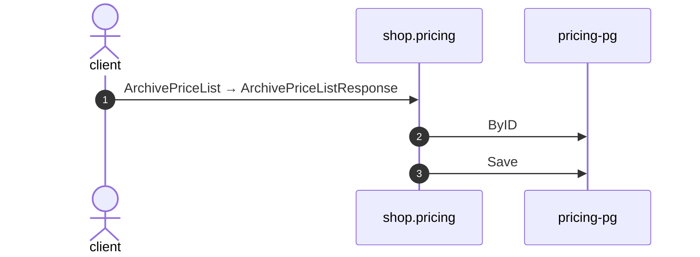

# Archive price list

*Generated from the portolan catalog · commit `10 sources` · at 2026-09-05T03:58:04Z. Do not edit by hand.*

- **Id:** `flow.pricing-archive-price-list`
- **Owner:** [shop](../shop/README.md)
- **Source:** [`examples/shop/pricing/internal/infrastructure/transport/grpc/price_list/handler.go`](https://github.com/shortlink-org/portolan/blob/main/examples/shop/pricing/internal/infrastructure/transport/grpc/price_list/handler.go)

Package archive_price_list takes a price list out of use without losing it.

## Participants

| Participant | Kind | Context |
| --- | --- | --- |
| `client` | actor | — |
| `shop.pricing` | service | [shop](../shop/README.md) |
| `pricing-pg` | store | [shop](../shop/README.md) |

## Sequence

## Steps

1. **client** → **shop.pricing** — ArchivePriceList → ArchivePriceListResponse
   status: declared · [`examples/shop/pricing/internal/infrastructure/transport/grpc/price_list/handler.go:50`](https://github.com/shortlink-org/portolan/blob/main/examples/shop/pricing/internal/infrastructure/transport/grpc/price_list/handler.go#L50)

2. **shop.pricing** → **pricing-pg** — ByID
   status: declared · [`examples/shop/pricing/internal/application/price_list/usecases/archive_price_list/usecase.go:22`](https://github.com/shortlink-org/portolan/blob/main/examples/shop/pricing/internal/application/price_list/usecases/archive_price_list/usecase.go#L22)

3. **shop.pricing** → **pricing-pg** — Save
   status: declared · [`examples/shop/pricing/internal/application/price_list/usecases/archive_price_list/usecase.go:28`](https://github.com/shortlink-org/portolan/blob/main/examples/shop/pricing/internal/application/price_list/usecases/archive_price_list/usecase.go#L28)
