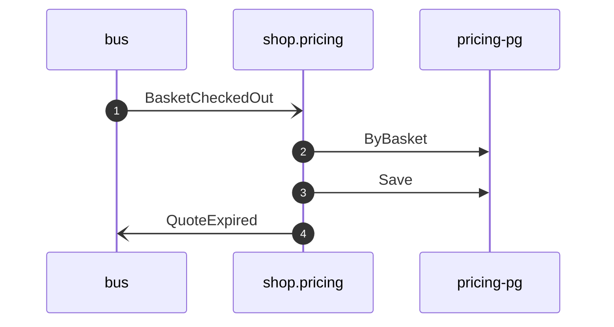

# Expire quote on checkout

*Generated from the portolan catalog · commit `6 sources` · at 2026-09-05T03:58:04Z. Do not edit by hand.*

- **Id:** `flow.pricing-expire-quote-on-checkout`
- **Owner:** [shop](../shop/README.md)
- **Source:** `examples/shop/pricing/internal/application/policy/expire_quote_on_checkout.go`

Ends the promise once the basket it priced is checked out.

## Participants

| Participant | Kind | Context |
| --- | --- | --- |
| `bus` | broker | — |
| `shop.pricing` | service | [shop](../shop/README.md) |
| `pricing-pg` | store | [shop](../shop/README.md) |

## Sequence

## Steps

1. **bus** → **shop.pricing** — BasketCheckedOut
   [shop.cart.basket.BasketCheckedOut](../shop/cart/aggregates/basket.md) · status: declared · `examples/shop/pricing/internal/application/policy/expire_quote_on_checkout.go:35`
2. **shop.pricing** → **pricing-pg** — ByBasket
   status: declared · `examples/shop/pricing/internal/application/policy/expire_quote_on_checkout.go:41`
3. **shop.pricing** → **pricing-pg** — Save
   status: declared · `examples/shop/pricing/internal/application/policy/expire_quote_on_checkout.go:55`
4. **shop.pricing** → **bus** — QuoteExpired
   [shop.pricing.quote.QuoteExpired](../shop/pricing/aggregates/quote.md) · status: declared · `examples/shop/pricing/internal/application/policy/expire_quote_on_checkout.go:55`
