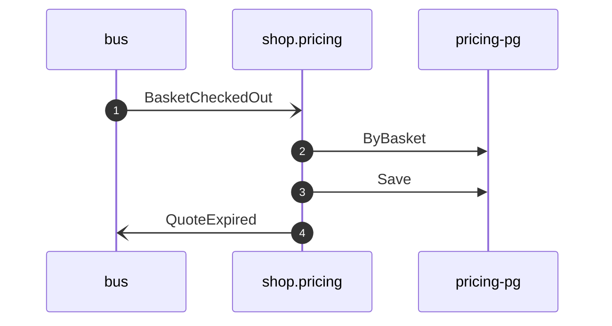

# Expire quote on checkout

*Generated from the portolan catalog · commit `7 sources` · at 2026-09-05T03:58:04Z. Do not edit by hand.*

- **Id:** `flow.pricing-expire-quote-on-checkout`
- **Owner:** [shop](../shop/README.md)
- **Source:** [`examples/shop/pricing/internal/application/policy/expire_quote_on_checkout.go`](https://github.com/shortlink-org/portolan/blob/main/examples/shop/pricing/internal/application/policy/expire_quote_on_checkout.go)

Ends the promise once the basket it priced is checked out.

## Participants

| Participant | Kind | Context |
| --- | --- | --- |
| `bus` | broker | — |
| `shop.pricing` | service | [shop](../shop/README.md) |
| `pricing-pg` | store | [shop](../shop/README.md) |

## Sequence

## Steps

1. **bus** → **shop.pricing** — BasketCheckedOut
   [`shop.cart.basket.BasketCheckedOut`](../shop/cart/aggregates/basket.md#event-shop-cart-basket-basketcheckedout) · status: declared · [`examples/shop/pricing/internal/application/policy/expire_quote_on_checkout.go:35`](https://github.com/shortlink-org/portolan/blob/main/examples/shop/pricing/internal/application/policy/expire_quote_on_checkout.go#L35)

2. **shop.pricing** → **pricing-pg** — ByBasket
   status: declared · [`examples/shop/pricing/internal/application/policy/expire_quote_on_checkout.go:41`](https://github.com/shortlink-org/portolan/blob/main/examples/shop/pricing/internal/application/policy/expire_quote_on_checkout.go#L41)

3. **shop.pricing** → **pricing-pg** — Save
   status: declared · [`examples/shop/pricing/internal/application/policy/expire_quote_on_checkout.go:55`](https://github.com/shortlink-org/portolan/blob/main/examples/shop/pricing/internal/application/policy/expire_quote_on_checkout.go#L55)

4. **shop.pricing** → **bus** — QuoteExpired
   [`shop.pricing.quote.QuoteExpired`](../shop/pricing/aggregates/quote.md#event-shop-pricing-quote-quoteexpired) · status: declared · [`examples/shop/pricing/internal/application/policy/expire_quote_on_checkout.go:55`](https://github.com/shortlink-org/portolan/blob/main/examples/shop/pricing/internal/application/policy/expire_quote_on_checkout.go#L55)
