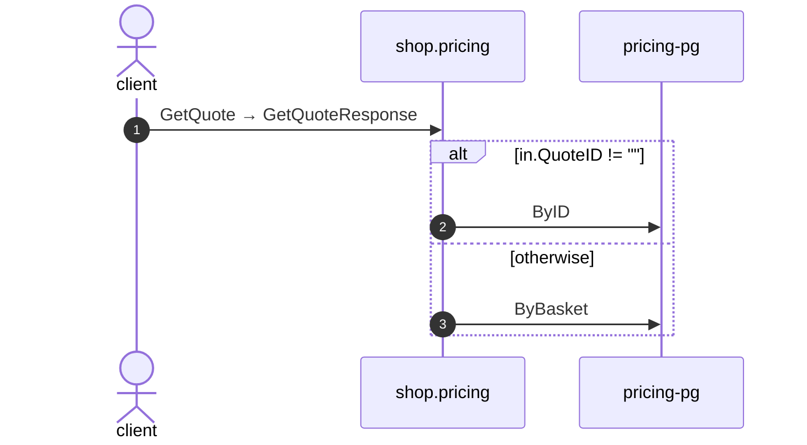

# Get quote

*Generated from the portolan catalog · commit `7 sources` · at 2026-09-05T03:14:52+07:00. Do not edit by hand.*

- **Id:** `flow.pricing-get-quote`
- **Owner:** [shop](../shop/README.md)
- **Source:** `examples/shop/pricing/internal/infrastructure/transport/grpc/quote/handler.go`

Package get_quote reads one quote.

## Participants

| Participant | Kind | Context |
| --- | --- | --- |
| `client` | actor | — |
| `shop.pricing` | service | [shop](../shop/README.md) |
| `pricing-pg` | store | [shop](../shop/README.md) |

## Sequence

## Steps

1. **client** → **shop.pricing** — GetQuote → GetQuoteResponse
   status: declared · `examples/shop/pricing/internal/infrastructure/transport/grpc/quote/handler.go:52`

> **One of**
>
> *in.QuoteID != ""*
>
> 2. **shop.pricing** → **pricing-pg** — ByID
>    status: declared · `examples/shop/pricing/internal/application/quote/usecases/get_quote/usecase.go:27`
>
> *otherwise*
>
> 3. **shop.pricing** → **pricing-pg** — ByBasket
>    status: declared · `examples/shop/pricing/internal/application/quote/usecases/get_quote/usecase.go:29`
