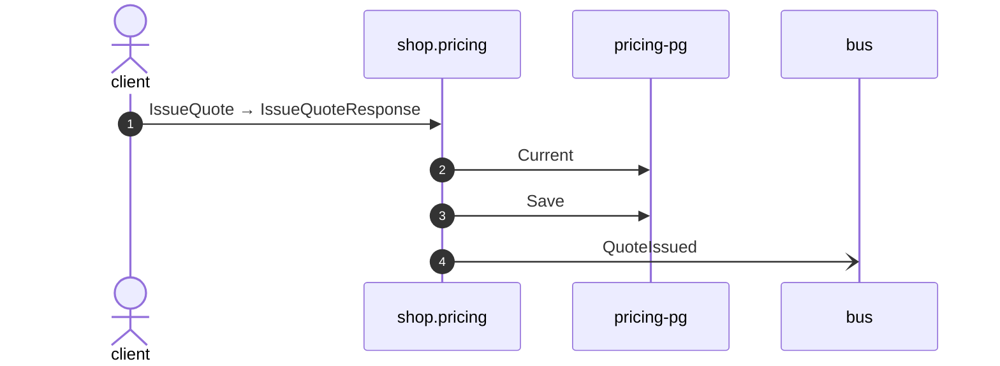

# Issue quote

*Generated from the portolan catalog · commit `5 sources` · at 2026-09-05T03:58:04Z. Do not edit by hand.*

- **Id:** `flow.pricing-issue-quote`
- **Owner:** [shop](../shop/README.md)
- **Source:** `examples/shop/pricing/internal/infrastructure/transport/grpc/quote/handler.go`

Package issue_quote prices a basket and promises the price for a while.

## Participants

| Participant | Kind | Context |
| --- | --- | --- |
| `client` | actor | — |
| `shop.pricing` | service | [shop](../shop/README.md) |
| `pricing-pg` | store | [shop](../shop/README.md) |
| `bus` | broker | — |

## Sequence

## Steps

1. **client** → **shop.pricing** — IssueQuote → IssueQuoteResponse
   status: declared · `examples/shop/pricing/internal/infrastructure/transport/grpc/quote/handler.go:28`
2. **shop.pricing** → **pricing-pg** — Current
   status: declared · `examples/shop/pricing/internal/application/quote/usecases/issue_quote/usecase.go:35`
3. **shop.pricing** → **pricing-pg** — Save
   status: declared · `examples/shop/pricing/internal/application/quote/usecases/issue_quote/usecase.go:55`
4. **shop.pricing** → **bus** — QuoteIssued
   [shop.pricing.quote.QuoteIssued](../shop/pricing/aggregates/quote.md) · status: declared · `examples/shop/pricing/internal/application/quote/usecases/issue_quote/usecase.go:55`
