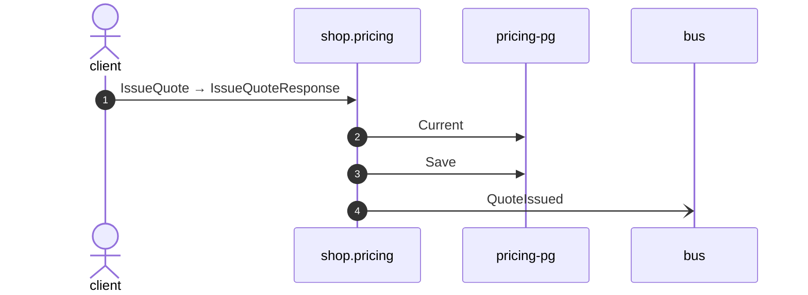

# Issue quote

*Generated from the portolan catalog · commit `9 sources` · at 2026-09-05T03:58:04Z. Do not edit by hand.*

- **Id:** `flow.pricing-issue-quote`
- **Owner:** [shop](../shop/README.md)
- **Source:** [`examples/shop/pricing/internal/infrastructure/transport/grpc/quote/handler.go`](https://github.com/shortlink-org/portolan/blob/main/examples/shop/pricing/internal/infrastructure/transport/grpc/quote/handler.go)

Package issue_quote prices a basket and promises the price for a while.

## Participants

| Participant | Kind | Context |
| --- | --- | --- |
| `client` | actor | — |
| `shop.pricing` | service | [shop](../shop/README.md) |
| `pricing-pg` | store | [shop](../shop/README.md) |
| `bus` | broker | — |

## Sequence

## Steps

1. **client** → **shop.pricing** — IssueQuote → IssueQuoteResponse
   status: declared · [`examples/shop/pricing/internal/infrastructure/transport/grpc/quote/handler.go:28`](https://github.com/shortlink-org/portolan/blob/main/examples/shop/pricing/internal/infrastructure/transport/grpc/quote/handler.go#L28)

2. **shop.pricing** → **pricing-pg** — Current
   status: declared · [`examples/shop/pricing/internal/application/quote/usecases/issue_quote/usecase.go:35`](https://github.com/shortlink-org/portolan/blob/main/examples/shop/pricing/internal/application/quote/usecases/issue_quote/usecase.go#L35)

3. **shop.pricing** → **pricing-pg** — Save
   status: declared · [`examples/shop/pricing/internal/application/quote/usecases/issue_quote/usecase.go:55`](https://github.com/shortlink-org/portolan/blob/main/examples/shop/pricing/internal/application/quote/usecases/issue_quote/usecase.go#L55)

4. **shop.pricing** → **bus** — QuoteIssued
   [`shop.pricing.quote.QuoteIssued`](../shop/pricing/aggregates/quote.md#event-shop-pricing-quote-quoteissued) · status: declared · [`examples/shop/pricing/internal/application/quote/usecases/issue_quote/usecase.go:55`](https://github.com/shortlink-org/portolan/blob/main/examples/shop/pricing/internal/application/quote/usecases/issue_quote/usecase.go#L55)
