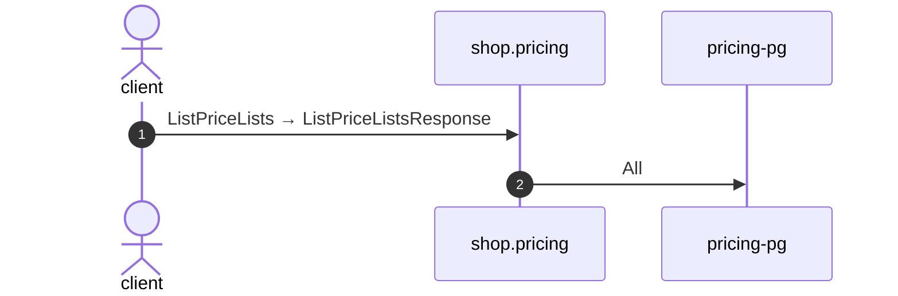

# List price lists

*Generated from the portolan catalog · commit `9 sources` · at 2026-08-29T09:14:22Z. Do not edit by hand.*

- **Id:** `flow.pricing-list-price-lists`
- **Owner:** [shop](../shop/README.md)
- **Source:** `examples/shop/pricing/internal/infrastructure/transport/grpc/price_list/handler.go`

Package list_price_lists reads every price list there is.

## Participants

| Participant | Kind | Context |
| --- | --- | --- |
| `client` | actor | — |
| `shop.pricing` | service | [shop](../shop/README.md) |
| `pricing-pg` | store | [shop](../shop/README.md) |

## Sequence

## Steps

1. **client** → **shop.pricing** — ListPriceLists → ListPriceListsResponse
   status: declared · `examples/shop/pricing/internal/infrastructure/transport/grpc/price_list/handler.go:60`
2. **shop.pricing** → **pricing-pg** — All
   status: declared · `examples/shop/pricing/internal/application/price_list/usecases/list_price_lists/usecase.go:22`
