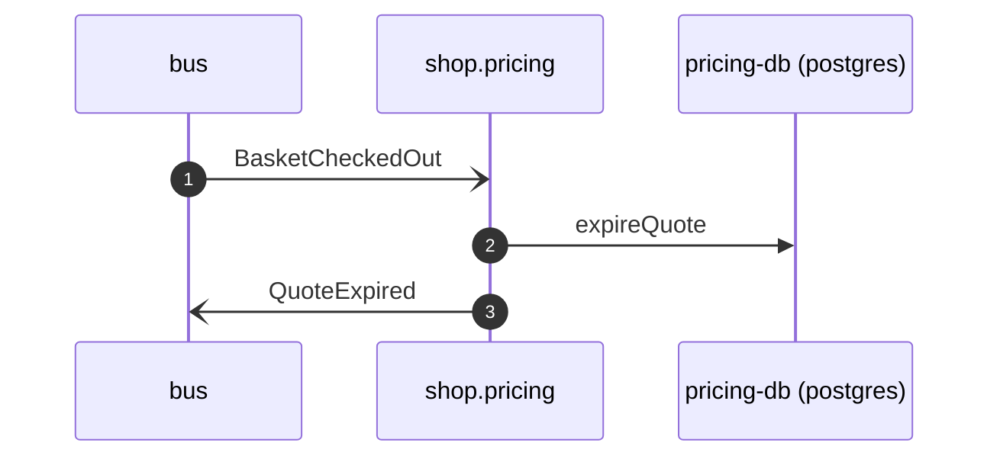

# Quote expired on checkout

*Generated from the portolan catalog · commit `5 sources` · at 2026-08-29T09:14:22Z. Do not edit by hand.*

- **Id:** `flow.quote-expired-on-checkout`
- **Owner:** [shop](../shop/README.md)
- **Source:** `services/pricing/internal/policy/expire_quote.go`

A basket that has been checked out is a basket whose quote is spent. Pricing hears the event the cart publishes and expires the quote it issued for that basket, so a second checkout of the same basket has to be priced again rather than reuse a number the price list may have moved on from.

## Participants

| Participant | Kind | Context | Label |
| --- | --- | --- | --- |
| `bus` | broker | — | — |
| `shop.pricing` | service | [shop](../shop/README.md) | — |
| `pricing-db` | store | [shop](../shop/README.md) | pricing-db (postgres) |

## Sequence

## Steps

1. **bus** → **shop.pricing** — BasketCheckedOut
   [shop.cart.basket.BasketCheckedOut](../shop/cart/aggregates/basket.md) · status: declared · `internal/policy/expire_quote.go:24` · One consumer group, the basket id as the routing key. A basket with no quote on file is ignored, not an error: not every basket was priced.
2. **shop.pricing** → **pricing-db** — expireQuote
   status: declared · `internal/adapter/postgres/quotes.go:71`
3. **shop.pricing** → **bus** — QuoteExpired
   [shop.pricing.quote.QuoteExpired](../shop/pricing/aggregates/quote.md) · status: declared · `internal/policy/expire_quote.go:31` · Published for the audit trail; nothing in the estate acts on it yet.
