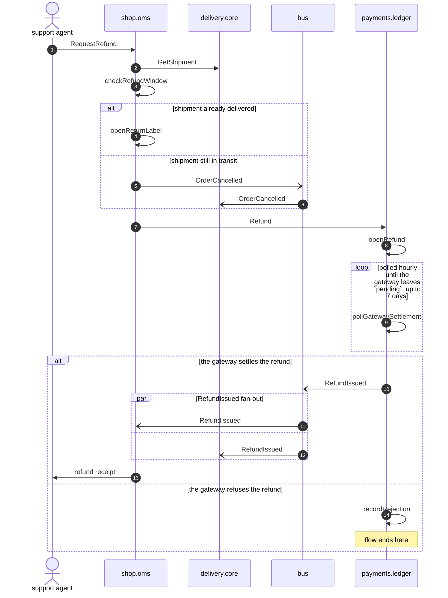

# Refund requested

*Generated from the portolan catalog · commit `3 sources` · at 2026-08-29T09:14:22Z. Do not edit by hand.*

- **Id:** `flow.refund-requested`
- **Owner:** [shop](../shop/README.md)
- **Source:** `docs/flows/refund-requested.md`

How a support-initiated refund is meant to travel: the window is read off the shipment, an undispatched parcel is recalled first, and the money is returned through the ledger. Written by hand from the design doc — not one step has been observed in a test or a trace, which is why every hop on this page is declared.

## Participants

| Participant | Kind | Context | Label |
| --- | --- | --- | --- |
| `agent` | actor | — | support agent |
| `shop.oms` | service | [shop](../shop/README.md) | — |
| `delivery.core` | service | [delivery](../delivery/README.md) | — |
| `bus` | broker | — | — |
| `payments.ledger` | service | [payments](../payments/README.md) | — |

## Sequence

## Steps

1. **agent** → **shop.oms** — RequestRefund
   status: declared · `refund-requested.md:24` · The support console, not the storefront. The doc does not say what authorizes the agent or whether a partial amount is allowed.
2. **shop.oms** → **delivery.core** — GetShipment
   `delivery.v1.Delivery/GetShipment` · status: declared · `internal/oms/client/delivery.go:41` · The refund window runs from the delivery date on the shipment, not from the order date, so the shipment has to be read before anything is decided.
3. **shop.oms** ↺ **shop.oms** — checkRefundWindow
   status: declared · `internal/oms/app/refund.go:52` · 30 days after delivery. Orders never delivered have no window at all — the doc leaves that case open.

> **One of**
>
> *shipment already delivered*
>
> 4. **shop.oms** ↺ **shop.oms** — openReturnLabel
>    status: declared · `internal/oms/app/refund.go:71`
>
> *shipment still in transit*
>
> 5. **shop.oms** → **bus** — OrderCancelled
>    [shop.oms.order.OrderCancelled](../shop/oms/aggregates/order.md) · status: declared · `refund-requested.md:58`
> 6. **bus** → **delivery.core** — OrderCancelled
>    [shop.oms.order.OrderCancelled](../shop/oms/aggregates/order.md) · status: declared · `refund-requested.md:61` · Delivery is expected to recall the parcel here. The handler is described in the design doc, but no subscription for OrderCancelled was found in the delivery repository.

7. **shop.oms** → **payments.ledger** — Refund
   `payments.v1.Payments/Refund` · status: declared · `internal/oms/client/payments.go:104` · Both branches rejoin here. The doc does not say what the amount is when the parcel was recalled but the shipping was already billed.
8. **payments.ledger** ↺ **payments.ledger** — openRefund
   status: declared · `internal/ledger/app/refund.go:31`

> **Repeats** — polled hourly until the gateway leaves `pending`, up to 7 days
>
> 9. **payments.ledger** ↺ **payments.ledger** — pollGatewaySettlement
>    status: declared · `internal/ledger/app/refund.go:64` · The doc says the gateway confirms by webhook and that the poll is only the fallback. Neither path is covered by a test, and nothing says what happens on day 8.

> **One of**
>
> *the gateway settles the refund*
>
> 10. **payments.ledger** → **bus** — RefundIssued
>    [payments.ledger.refund.RefundIssued](../payments/ledger/aggregates/refund.md) · status: declared · `refund-requested.md:83`
>
> > **In parallel** — RefundIssued fan-out
> >
> > *Branch 1*
> >
> > 11. **bus** → **shop.oms** — RefundIssued
> >    [payments.ledger.refund.RefundIssued](../payments/ledger/aggregates/refund.md) · status: declared · `refund-requested.md:88` · Moves the order to `refunded`.
> >
> > *Branch 2*
> >
> > 12. **bus** → **delivery.core** — RefundIssued
> >    [payments.ledger.refund.RefundIssued](../payments/ledger/aggregates/refund.md) · status: declared · `refund-requested.md:91` · Closes the return leg. Same gap as the cancel handler above: declared in the doc, absent from the repository.
>
> 13. **shop.oms** → **agent** — refund receipt
>    status: declared · `refund-requested.md:96`
>
> *the gateway refuses the refund — *ends the flow**
>
> 14. **payments.ledger** ↺ **payments.ledger** — recordRejection
>    status: declared · `refund-requested.md:101` · The code and category are stored on the refund and nothing publishes them. Support finds out by looking, which the doc admits and does not fix.
