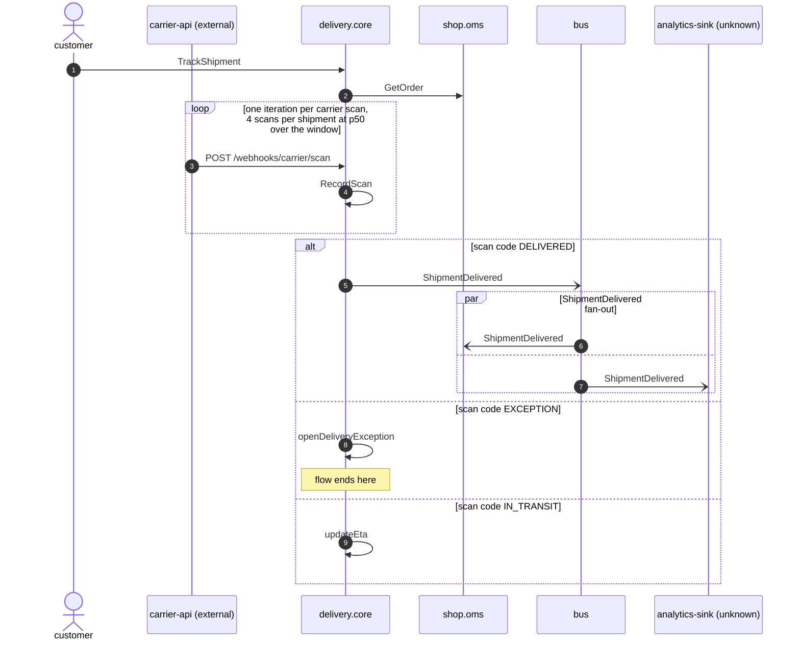

# Shipment tracking

*Generated from the portolan catalog · commit `5 sources` · at 2026-08-29T09:14:22Z. Do not edit by hand.*

- **Id:** `flow.shipment-tracking`
- **Owner:** [delivery](../delivery/README.md)
- **Source:** `data/flows/shipment-tracking.flow.md`

Reconstructed from production traces over a 24 hour window: the tracking page, the carrier's scan webhook, and what each scan code sets off. Two things only the traces know about — a consumer no repository accounts for, and an exception path whose reader emits no spans at all.

## Participants

| Participant | Kind | Context | Label |
| --- | --- | --- | --- |
| `customer` | actor | — | — |
| `carrier-api` | external | — | carrier-api (external) |
| `delivery.core` | service | [delivery](../delivery/README.md) | — |
| `shop.oms` | service | [shop](../shop/README.md) | — |
| `bus` | broker | — | — |
| `analytics-sink` | unknown | — | analytics-sink (unknown) |

## Sequence

## Steps

1. **customer** → **delivery.core** — TrackShipment
   `trace 9f2c1a../span 04` · Storefront tracking page. 41k calls in the window, p95 180 ms.
2. **delivery.core** → **shop.oms** — GetOrder
   `shop.v1.Orders/GetOrder` · `trace 9f2c1a../span 06` · Resolves the order reference shown beside the parcel. Present in 96% of the traces; the rest are served from the tracking cache.

> **Repeats** — one iteration per carrier scan; 4 scans per shipment at p50 over the window
>
> 3. **carrier-api** → **delivery.core** — POST /webhooks/carrier/scan
>    `trace 7be40d../span 01` · Signed with the carrier's shared secret. 1.3% of scans in the window are retries after a 5xx, and the traces show the retry landing on the same shipment without a second state change.
> 4. **delivery.core** ↺ **delivery.core** — RecordScan
>    `trace 7be40d../span 03`

> **One of**
>
> *scan code DELIVERED*
>
> 5. **delivery.core** → **bus** — ShipmentDelivered
>    [delivery.core.shipment.ShipmentDelivered](../delivery/core/aggregates/shipment.md) · `trace 7be40d../span 27`
>
> > **In parallel** — ShipmentDelivered fan-out
> >
> > *Branch 1*
> >
> > 6. **bus** → **shop.oms** — ShipmentDelivered
> >    [delivery.core.shipment.ShipmentDelivered](../delivery/core/aggregates/shipment.md) · `trace 7be40d../span 29` · Closes the order and starts the 30-day refund window the refund flow reads.
> >
> > *Branch 2*
> >
> > 7. **bus** → **analytics-sink** — ShipmentDelivered
> >    [delivery.core.shipment.ShipmentDelivered](../delivery/core/aggregates/shipment.md) · status: unresolved · `trace 7be40d../span 31` · Seen in traces only, under client id `analytics-sink-2`. No subscription registration exists in any indexed repository, so the owning team is unknown and nobody can be told before this topic changes shape.
>
>
> *scan code EXCEPTION — *ends the flow**
>
> 8. **delivery.core** ↺ **delivery.core** — openDeliveryException
>    `trace 4c81f3../span 09` · The trace ends here. Whatever reads the exception queue emits no spans, so the catalog cannot say what happens to the parcel next.
>
> *scan code IN_TRANSIT*
>
> 9. **delivery.core** ↺ **delivery.core** — updateEta
>    `trace 7be40d../span 12` · No event is published for an in-transit scan; the tracking page reads the shipment directly. 83% of the scans in the window end here.
