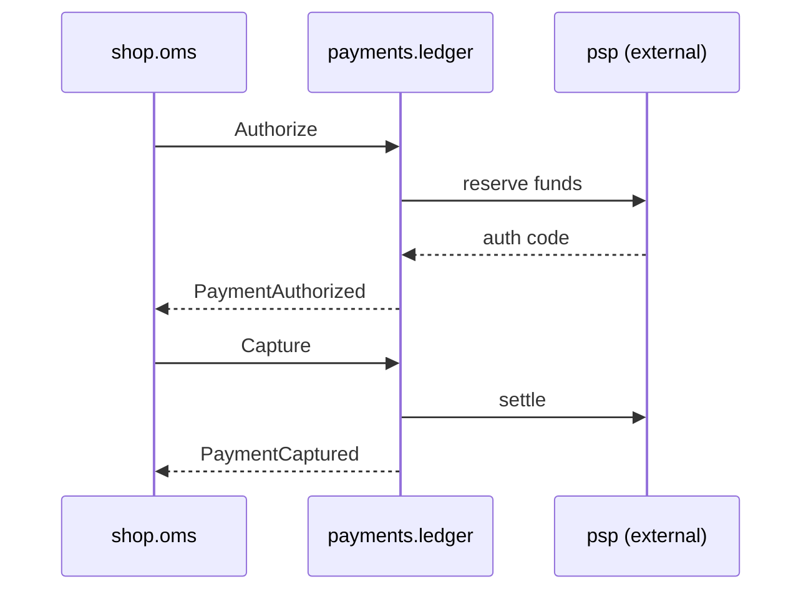

# Ledger

*Generated from the portolan catalog · commit `2 sources` · at 2026-08-29T09:14:22Z. Do not edit by hand.*

- **Id:** `payments.ledger`
- **Context:** [Payments](../README.md)
- **Repo:** `github.com/acme/payments`
- **Path:** `services/ledger`

## Payments Ledger

`payments.ledger` is a double-entry ledger. Every movement of money is two
balanced postings, and nothing is ever deleted. Corrections are compensating
entries.

### Model

An authorisation reserves funds without moving them. A capture moves the
reserved funds. A refund moves them back. Each of these is a separate posting
pair against the customer, merchant and settlement accounts.

### Accounts

| Account        | Type      | Increases on        | Decreases on       |
| -------------- | --------- | ------------------- | ------------------ |
| `customer`     | liability | refund              | capture            |
| `merchant`     | asset     | capture             | refund             |
| `settlement`   | asset     | payout received     | payout disbursed   |
| `fees`         | expense   | capture             | refund             |

### Guarantees

- Postings are append only. There is no `UPDATE` on the postings table.
- Every write is idempotent on `idempotency_key`, retained for 30 days.
- The sum of all postings for a transaction is always zero; a nightly job
  asserts this and pages on failure.

### Aggregates

- `payment` — authorisation, capture and decline.
- `refund` — full and partial refunds against a captured payment.

## Aggregates

| Aggregate | Root | Commands | Queries | Events |
| --- | --- | --- | --- | --- |
| [Payment](aggregates/payment.md) | `Payment` | 3 commands | 1 query | 3 events |
| [Refund](aggregates/refund.md) | `Refund` | 1 command | 1 query | 1 event |

## Provides

**`payments.v1.Payments`** — `proto/payments/v1/payments.proto:14`

- `Authorize`
- `Capture`
- `Refund`
- `GetPayment`

AuthorizeRequest

| Field | Type | Doc |
| --- | --- | --- |
| `orderId` | `string` | Order to authorize against. |
| `amount` | [`Money`](../../types.md#money) | Amount to hold. |

## Consumes

| Call | Peer | Status | Source | Note |
| --- | --- | --- | --- | --- |
| `shop.v1.Orders/GetOrder` | [shop.oms](../../shop/oms/README.md) | verified | `internal/ledger/client/orders.go:27` | — |
| `psp.v2.Charges/Create` | `psp-gateway` | unresolved | `internal/ledger/adapter/psp/client.go:64` | Authorization. The peer is a third party; no service in the estate provides psp.v2.Charges, so the call cannot be resolved to anything the catalog knows. |
| `psp.v2.Charges/Capture` | `psp-gateway` | unresolved | `internal/ledger/adapter/psp/client.go:102` | Settlement of an existing authorization. Same unresolvable peer as the rest of psp.v2.Charges. |
| `psp.v2.Charges/Refund` | `psp-gateway` | unresolved | `internal/ledger/adapter/psp/client.go:138` | Returns money on a settled charge. Same unresolvable peer as the rest of psp.v2.Charges. |
| `psp.v2.Charges/Void` | `psp-gateway` | unresolved | `internal/ledger/adapter/psp/client.go:171` | Cancels an authorization that was never captured. Same unresolvable peer as the rest of psp.v2.Charges. |

## Publishes

| Event | Latest | Consumers |
| --- | --- | --- |
| [PaymentAuthorized](aggregates/payment.md) | v1 | [shop.oms](../../shop/oms/README.md), [delivery.core (declared)](../../delivery/core/README.md) |
| [PaymentCaptured](aggregates/payment.md) | v1 | [delivery.core](../../delivery/core/README.md), [shop.oms](../../shop/oms/README.md) |
| [PaymentDeclined](aggregates/payment.md) | v1 | [shop.oms](../../shop/oms/README.md) |
| [RefundIssued](aggregates/refund.md) | v1 | [shop.oms (declared)](../../shop/oms/README.md), [delivery.core (declared)](../../delivery/core/README.md) |

## Stores

| Store | Kind | Access | Tables |
| --- | --- | --- | --- |
| [Ledger database](stores/pg.md) | postgres | owns | 2 tables |
