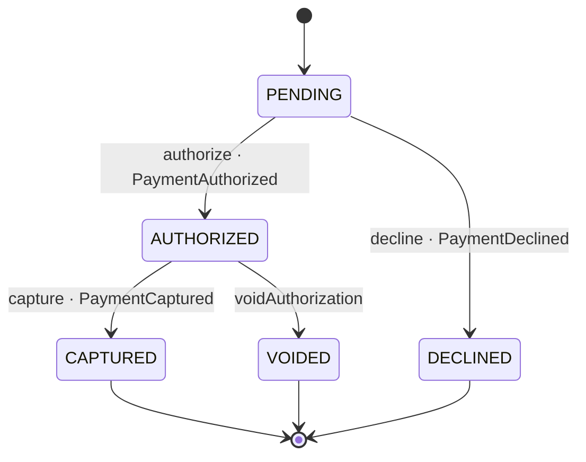

# Payment

*Generated from the portolan catalog · commit `10 sources` · at 2026-09-05T03:58:04Z. Do not edit by hand.*

- **Id:** `payments.ledger.payment`
- **Service:** [Ledger](../README.md)
- **Root:** `Payment`

What one order owes, and everything that has happened to that money.

## Entities

### Payment — aggregate root

What one order owes, and everything that has happened to that money.

| Field | Type | Doc |
| --- | --- | --- |
| `id` | `String` | — |
| `orderId` | `String` | The order this payment is for. Another context owns it, so this is its id and not its shape. |
| `amount` | `Money` | — |
| `attempt` | `int` | Which try at charging this order it is. payments.0004 keys the row on it. |
| `createdAt` | `Instant` | — |
| `postings` | `List<Posting>` | — |
| `status` | `PaymentStatus` | — |
| `authCode` | `String` | — |

### Posting

One side of one movement of money.

| Field | Type |
| --- | --- |
| `account` | `String` |
| `amount` | `Money` |
| `writtenAt` | `Instant` |

## Value objects

### Giveback

What the gateway answers when asked to send money back: it did, under a reference of its own, or it would not. Unreachable throws {@link GatewayUnavailable}, as with a hold.

| Field | Type |
| --- | --- |
| `sent` | `boolean` |
| `reference` | `String` |

### Hold

What the gateway answers when asked to hold money: it did, with the code that names the hold, or it refused, with a reason this service can act on.

| Field | Type |
| --- | --- |
| `held` | `boolean` |
| `authCode` | `String` |
| `refusal` | `DeclineReason` |

### Money

An amount in the minor unit of a currency: 1250 GBP is £12.50.

| Field | Type |
| --- | --- |
| `amountMinor` | `long` |
| `currency` | `String` |

## Lifecycle

| From | To | On | Emits | Source |
| --- | --- | --- | --- | --- |
| `PENDING` | `AUTHORIZED` | `authorize` | `PaymentAuthorized` | [`examples/payments/ledger/src/main/java/org/portolan/payments/ledger/domain/payment/Payment.java:75`](https://github.com/shortlink-org/portolan/blob/main/examples/payments/ledger/src/main/java/org/portolan/payments/ledger/domain/payment/Payment.java#L75) |
| `AUTHORIZED` | `CAPTURED` | `capture` | `PaymentCaptured` | [`examples/payments/ledger/src/main/java/org/portolan/payments/ledger/domain/payment/Payment.java:86`](https://github.com/shortlink-org/portolan/blob/main/examples/payments/ledger/src/main/java/org/portolan/payments/ledger/domain/payment/Payment.java#L86) |
| `PENDING` | `DECLINED` | `decline` | `PaymentDeclined` | [`examples/payments/ledger/src/main/java/org/portolan/payments/ledger/domain/payment/Payment.java:95`](https://github.com/shortlink-org/portolan/blob/main/examples/payments/ledger/src/main/java/org/portolan/payments/ledger/domain/payment/Payment.java#L95) |
| `AUTHORIZED` | `VOIDED` | `voidAuthorization` | — | [`examples/payments/ledger/src/main/java/org/portolan/payments/ledger/domain/payment/Payment.java:102`](https://github.com/shortlink-org/portolan/blob/main/examples/payments/ledger/src/main/java/org/portolan/payments/ledger/domain/payment/Payment.java#L102) |

## Operations

| Operation | Kind | Exposed by | Doc |
| --- | --- | --- | --- |
| `AuthorizePayment` | command | `Authorize` | Asks the gateway to hold the money for an order, and records either that it agreed or that it refused. |
| `CapturePayment` | command | `Capture` | Moves the money the gateway was holding, writes the pair of postings for it, and says so on the bus. |
| `GetPayment` | query | `GetPayment` | Reads one payment, for whoever is asking what happened to the money. |
| `VoidPayment` | command | *internal* | Gives back a hold nobody is going to be charged for. |

## Events

### PaymentAuthorized

`payments.ledger.payment.PaymentAuthorized`

On the wire as `ledger.PaymentAuthorized`, on `payments.ledger.payment`.

| Consumer | Status | Via |
| --- | --- | --- |
| [shop.oms](../../../shop/oms/README.md) | declared | `oms-confirm-order-on-payment-authorized#s1` |

#### v1 — current

The gateway agreed to hold the money. Nothing has moved yet.

Source: [`examples/payments/ledger/src/main/java/org/portolan/payments/ledger/domain/payment/event/PaymentAuthorized.java`](https://github.com/shortlink-org/portolan/blob/main/examples/payments/ledger/src/main/java/org/portolan/payments/ledger/domain/payment/event/PaymentAuthorized.java)

| Field | Type |
| --- | --- |
| `paymentId` | `String` |
| `orderId` | `String` |
| `amount` | `Money` |
| `occurredAt` | `Instant` |

### PaymentCaptured

`payments.ledger.payment.PaymentCaptured`

On the wire as `ledger.PaymentCaptured`, on `payments.ledger.payment`.

| Consumer | Status | Via |
| --- | --- | --- |
| [shop.billing](../../../shop/billing/README.md) | declared | `billing-close-invoice-on-payment#s1` |
| [delivery.core](../../../delivery/core/README.md) | declared | `core-release-shipment-on-payment-captured#s1` |

#### v1 — current

The money moved. Whoever is owed something for this order - the invoice, the warehouse - waits for this one and nothing earlier.

Source: [`examples/payments/ledger/src/main/java/org/portolan/payments/ledger/domain/payment/event/PaymentCaptured.java`](https://github.com/shortlink-org/portolan/blob/main/examples/payments/ledger/src/main/java/org/portolan/payments/ledger/domain/payment/event/PaymentCaptured.java)

| Field | Type |
| --- | --- |
| `paymentId` | `String` |
| `orderId` | `String` |
| `amount` | `Money` |
| `occurredAt` | `Instant` |

### PaymentDeclined

`payments.ledger.payment.PaymentDeclined`

On the wire as `ledger.PaymentDeclined`, on `payments.ledger.payment`.

#### v1 — current

The money was not held, and the reason is one of a closed set a consumer can switch on.

Source: [`examples/payments/ledger/src/main/java/org/portolan/payments/ledger/domain/payment/event/PaymentDeclined.java`](https://github.com/shortlink-org/portolan/blob/main/examples/payments/ledger/src/main/java/org/portolan/payments/ledger/domain/payment/event/PaymentDeclined.java)

| Field | Type |
| --- | --- |
| `paymentId` | `String` |
| `orderId` | `String` |
| `reason` | `DeclineReason` |
| `occurredAt` | `Instant` |
