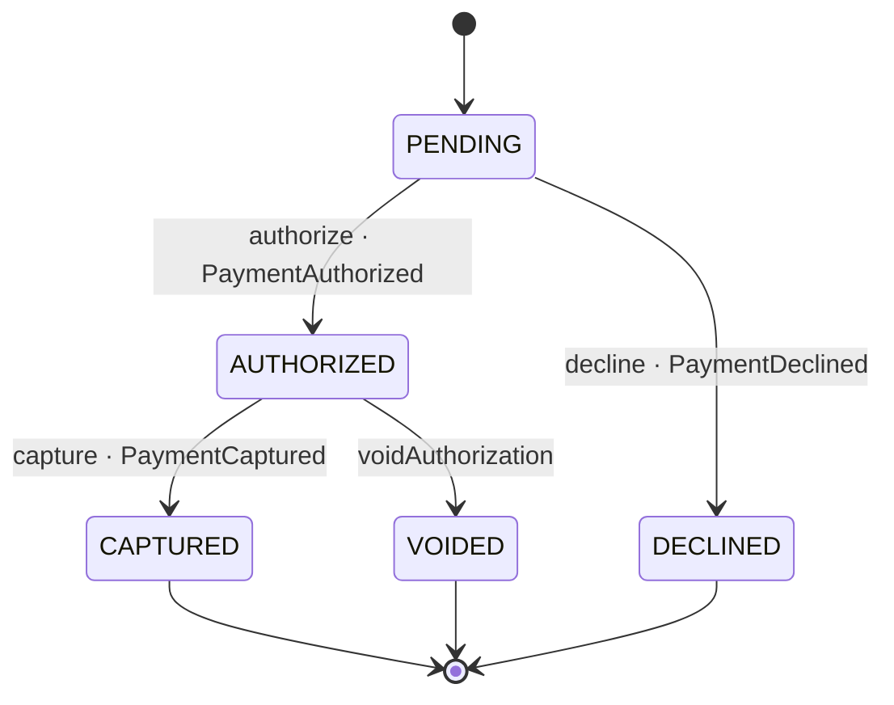

# Payment

*Generated from the portolan catalog · commit `6 sources` · at 2026-09-05T03:58:04Z. Do not edit by hand.*

- **Id:** `payments.ledger.payment`
- **Service:** [Ledger](../README.md)
- **Root:** `Payment`

What one order owes, and everything that has happened to that money.

## Entities

### Payment — aggregate root

What one order owes, and everything that has happened to that money.

| Field | Type | Doc |
| --- | --- | --- |
| `id` | `String` | — |
| `orderId` | `String` | The order this payment is for. Another context owns it, so this is its id and not its shape. |
| `amount` | `Money` | — |
| `attempt` | `int` | Which try at charging this order it is. payments.0004 keys the row on it. |
| `createdAt` | `Instant` | — |
| `postings` | `List<Posting>` | — |
| `status` | `PaymentStatus` | — |
| `authCode` | `String` | — |

### Posting

One side of one movement of money.

| Field | Type |
| --- | --- |
| `account` | `String` |
| `amount` | `Money` |
| `writtenAt` | `String` |

## Value objects

### Money

An amount in the minor unit of a currency: 1250 GBP is £12.50.

| Field | Type |
| --- | --- |
| `amountMinor` | `long` |
| `currency` | `String` |

## Lifecycle

| From | To | On | Emits | Source |
| --- | --- | --- | --- | --- |
| `PENDING` | `AUTHORIZED` | `authorize` | `PaymentAuthorized` | `examples/payments/ledger/src/main/java/org/portolan/payments/ledger/domain/payment/Payment.java:61` |
| `AUTHORIZED` | `CAPTURED` | `capture` | `PaymentCaptured` | `examples/payments/ledger/src/main/java/org/portolan/payments/ledger/domain/payment/Payment.java:72` |
| `PENDING` | `DECLINED` | `decline` | `PaymentDeclined` | `examples/payments/ledger/src/main/java/org/portolan/payments/ledger/domain/payment/Payment.java:78` |
| `AUTHORIZED` | `VOIDED` | `voidAuthorization` | — | `examples/payments/ledger/src/main/java/org/portolan/payments/ledger/domain/payment/Payment.java:84` |

## Operations

| Operation | Kind | Exposed by | Doc |
| --- | --- | --- | --- |
| `AuthorizePayment` | command | `Authorize` | Asks the gateway to hold the money for an order, and records either that it agreed or that it refused. |
| `CapturePayment` | command | `Capture` | Moves the money the gateway was holding, writes the pair of postings for it, and says so on the bus. |
| `GetPayment` | query | `GetPayment` | Reads one payment, for whoever is asking what happened to the money. |

## Events

### PaymentAuthorized

`payments.ledger.payment.PaymentAuthorized`

On the wire as `ledger.PaymentAuthorized`, on `payments.ledger.payment`.

| Consumer | Status |
| --- | --- |
| [shop.oms](../../../shop/oms/README.md) | declared |

#### v1 — current

The gateway agreed to hold the money. Nothing has moved yet.

Source: `examples/payments/ledger/src/main/java/org/portolan/payments/ledger/domain/payment/event/PaymentAuthorized.java`

| Field | Type |
| --- | --- |
| `paymentId` | `String` |
| `orderId` | `String` |
| `amount` | `Money` |
| `authCode` | `String` |

### PaymentCaptured

`payments.ledger.payment.PaymentCaptured`

On the wire as `ledger.PaymentCaptured`, on `payments.ledger.payment`.

| Consumer | Status |
| --- | --- |
| [shop.billing](../../../shop/billing/README.md) | declared |
| [delivery.core](../../../delivery/core/README.md) | declared |

#### v1 — current

The money moved. Whoever is owed something for this order - the invoice, the warehouse - waits for this one and nothing earlier.

Source: `examples/payments/ledger/src/main/java/org/portolan/payments/ledger/domain/payment/event/PaymentCaptured.java`

| Field | Type |
| --- | --- |
| `paymentId` | `String` |
| `orderId` | `String` |
| `amount` | `Money` |
| `capturedAt` | `String` |

### PaymentDeclined

`payments.ledger.payment.PaymentDeclined`

On the wire as `ledger.PaymentDeclined`, on `payments.ledger.payment`.

#### v1 — current

The gateway refused, and it says why in its own words rather than ours.

Source: `examples/payments/ledger/src/main/java/org/portolan/payments/ledger/domain/payment/event/PaymentDeclined.java`

| Field | Type |
| --- | --- |
| `paymentId` | `String` |
| `orderId` | `String` |
| `reason` | `String` |
