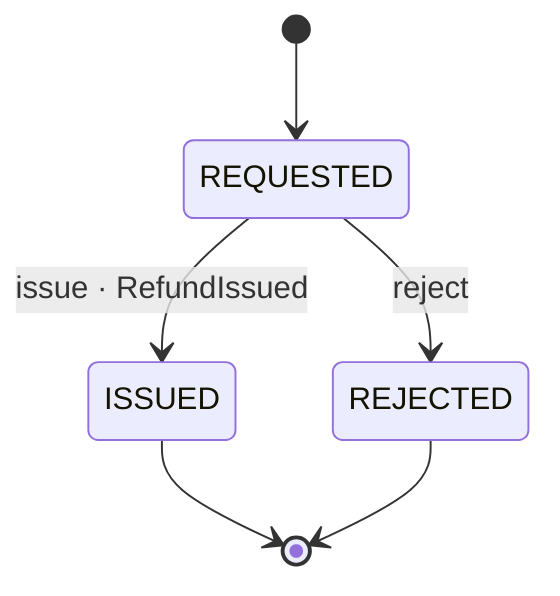

# Refund

*Generated from the portolan catalog · commit `6 sources` · at 2026-08-29T09:14:22Z. Do not edit by hand.*

- **Id:** `payments.ledger.refund`
- **Service:** [Ledger](../README.md)
- **Root:** `Refund`

Money going back, against a payment that was captured.

## Entities

### Refund — aggregate root

Money going back, against a payment that was captured.

| Field | Type |
| --- | --- |
| `id` | `String` |
| `paymentId` | `String` |
| `orderId` | `String` |
| `amount` | `Money` |
| `reason` | `String` |
| `status` | `RefundStatus` |
| `settledAt` | `Instant` |

## Lifecycle

| From | To | On | Emits | Source |
| --- | --- | --- | --- | --- |
| `REQUESTED` | `ISSUED` | `issue` | `RefundIssued` | `examples/payments/ledger/src/main/java/org/portolan/payments/ledger/domain/refund/Refund.java:41` |
| `REQUESTED` | `REJECTED` | `reject` | — | `examples/payments/ledger/src/main/java/org/portolan/payments/ledger/domain/refund/Refund.java:47` |

## Operations

| Operation | Kind | Exposed by | Doc |
| --- | --- | --- | --- |
| `IssueRefund` | command | `IssueRefund` | Sends money back against a captured payment, in full or in part. |
| `ListRefunds` | query | `ListRefunds` | Every refund against one payment, newest first. |

## Events

### RefundIssued

`payments.ledger.refund.RefundIssued`

On the wire as `ledger.RefundIssued`, on `payments.ledger.refund`.

#### v1 — current

Money went back to the customer, against a payment that had been captured.

Source: `examples/payments/ledger/src/main/java/org/portolan/payments/ledger/domain/refund/event/RefundIssued.java`

| Field | Type |
| --- | --- |
| `refundId` | `String` |
| `paymentId` | `String` |
| `orderId` | `String` |
| `amount` | `Money` |
| `reason` | `String` |
