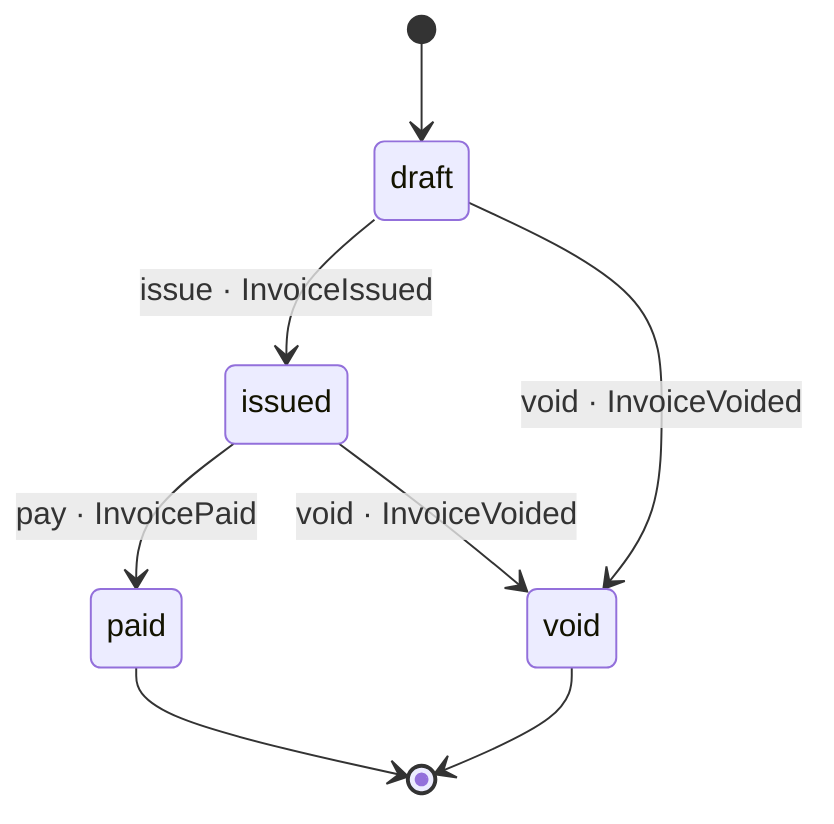

# Invoice

*Generated from the portolan catalog · commit `8 sources` · at 2026-08-29T09:14:22Z. Do not edit by hand.*

- **Id:** `shop.billing.invoice`
- **Service:** [Billing](../README.md)
- **Root:** `Invoice`

What a customer owes for one order, and what happens to it between being drawn
up and being closed.

An invoice is drawn up as a draft with its lines, issued once somebody with a
live session asks for it, and closed when the ledger says the money arrived.
Nothing about it is updated in place after it is paid or voided: those are the
two ends of its life, and a correction is a new invoice.

## Entities

### Invoice — aggregate root

What a customer owes for one order, and where it is in its life.

| Field | Type | Doc |
| --- | --- | --- |
| `id` | `UUIDField` | — |
| `order_id` | `UUIDField` | The order this invoice is drawn up for. |
| `customer_id` | `UUIDField` | Opaque, and only ever as good as the session auth vouched for. |
| `number` | `CharField` | What the customer quotes. A draft has none. |
| `currency` | `CharField` | ISO 4217, frozen when the first line is drawn up. |
| `total_minor` | `BigIntegerField` | The sum of the lines, in the minor unit of the currency. |
| `tax_rate` | `DecimalField` | The rate the total was taxed at. |
| `status` | `CharField` | — |
| `drawn_up_at` | `DateTimeField` | — |
| `issued_at` | `DateTimeField` | — |
| `settled_at` | `DateTimeField` | When it was paid or voided; null while it is neither. |

### InvoiceLine

One line of an invoice: what was bought, and what it was sold at.

| Field | Type | Doc |
| --- | --- | --- |
| `invoice` | `ForeignKey[Invoice]` | — |
| `sku` | `CharField` | — |
| `quantity` | `PositiveIntegerField` | — |
| `unit_price_minor` | `BigIntegerField` | Captured when the line is drawn up, never recomputed. |

## Value objects

### Money

An amount in the minor unit of a currency: 1250 GBP is £12.50.

| Field | Type |
| --- | --- |
| `amount_minor` | `int` |
| `currency` | `str` |

## Lifecycle

| From | To | On | Emits | Source |
| --- | --- | --- | --- | --- |
| `draft` | `issued` | `issue` | `InvoiceIssued` | `examples/shop/billing/invoices/models.py:48` |
| `issued` | `paid` | `pay` | `InvoicePaid` | `examples/shop/billing/invoices/models.py:54` |
| `draft` | `void` | `void` | `InvoiceVoided` | `examples/shop/billing/invoices/models.py:60` |
| `issued` | `void` | `void` | `InvoiceVoided` | `examples/shop/billing/invoices/models.py:60` |

## Operations

| Operation | Kind | Exposed by | Doc |
| --- | --- | --- | --- |
| `DrawUpInvoice` | command | `invoice_create` | Draws up a draft invoice for an order, with a line for each thing sold. |
| `GetInvoice` | query | `invoice_retrieve` | Reads one invoice and the lines it is made of. |
| `IssueInvoice` | command | `invoice_issue` | Confirms the session, freezes the invoice and asks the customer to pay. |
| `PayInvoice` | command | *internal* | Closes an issued invoice against the money the ledger says arrived. |
| `VoidInvoice` | command | `invoice_destroy` | Ends an invoice nobody is going to pay. |

## Events

### InvoiceIssued

`shop.billing.invoice.InvoiceIssued`

On the wire as `billing.InvoiceIssued`, on `shop.billing.invoice`.

#### v1 — current

The invoice is final and the customer has been asked to pay it.

Source: `examples/shop/billing/invoices/events.py`

| Field | Type |
| --- | --- |
| `invoice_id` | `str` |
| `order_id` | `str` |
| `number` | `str` |
| `total_minor` | `int` |
| `currency` | `str` |

### InvoicePaid

`shop.billing.invoice.InvoicePaid`

On the wire as `billing.InvoicePaid`, on `shop.billing.invoice`.

#### v1 — current

The money arrived and the invoice is closed. Nothing is owed on the order.

Source: `examples/shop/billing/invoices/events.py`

| Field | Type |
| --- | --- |
| `invoice_id` | `str` |
| `order_id` | `str` |
| `paid_at` | `str` |

### InvoiceVoided

`shop.billing.invoice.InvoiceVoided`

On the wire as `billing.InvoiceVoided`, on `shop.billing.invoice`.

#### v1 — current

The invoice was ended without payment, and nobody will be asked again.

Source: `examples/shop/billing/invoices/events.py`

| Field | Type |
| --- | --- |
| `invoice_id` | `str` |
| `order_id` | `str` |
| `reason` | `str` |
