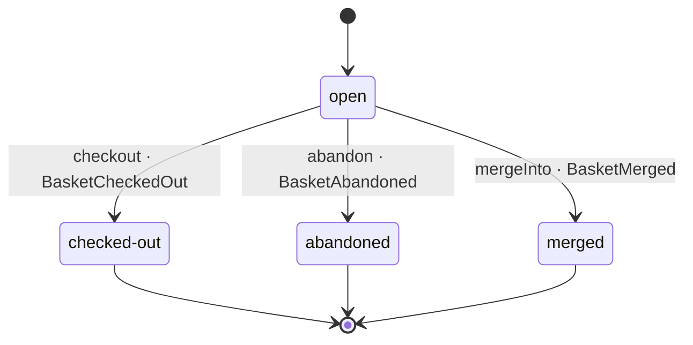

# Basket

*Generated from the portolan catalog · commit `5 sources` · at 2026-08-29T09:14:22Z. Do not edit by hand.*

- **Id:** `shop.cart.basket`
- **Service:** [Shopping Cart](../README.md)
- **Root:** `Basket`

The one mutable thing between a customer arriving and an order existing: a
visitor's or a customer's lines, under one lock. It changes as items go in and
out and stops changing the moment it is checked out; from then on the order is
somebody else's aggregate and the basket is a record of what was bought.

## States

`open` → `checked-out` | `abandoned` | `merged`, and nothing leads back. The
table is `status.ts`, and `moveTo` is the only way through it; lines go in
and out only while the basket is `open`. Each way out publishes: checkout
`BasketCheckedOut`, the sweep `BasketAbandoned`, a merge `BasketMerged` from
the basket that emptied.

## Invariants

- One currency, set by the first line and never changed (cart.0002).
- A line's price is what it was given when added, never recomputed (cart.0003).
- One to 99 of a SKU per line; at most 50 distinct SKUs.
- A version travels with every write; a write from a stale read is refused.

## Entities

### Basket — aggregate root

Basket is the aggregate root: a visitor's or a customer's lines, their
currency and their state, decided under one lock. Every method that changes
it answers with the fact, and publishing is the caller's business. Where
it can go from where it is, `status.ts` says in one table; `moveTo` is the
only way through it.

| Field | Type | Doc |
| --- | --- | --- |
| `id` | `string` | — |
| `token` | `string` | The capability to change an anonymous basket (cart.0007). |
| `customerId` | `string \| undefined` | — |
| `currency` | `Currency \| undefined` | Set by the first line, never changed (cart.0002). |
| `status` | `BasketStatus` | — |
| `items` | `BasketItem[]` | — |
| `touchedAt` | `Date` | — |
| `version` | `number` | Bumped by every write; a write from a stale read is refused. |

### BasketError

What the basket refuses, and why, in a word a caller can switch on.

| Field | Type |
| --- | --- |
| `code` | `BasketErrorCode` |

### BasketItem

One line: a SKU, how many, and what each one cost when it went in.

| Field | Type |
| --- | --- |
| `sku` | `string` |
| `quantity` | `number` |
| `unitPrice` | `Money` |

## Value objects

### Currency

ISO 4217, upper case. A basket has one, set by its first line.

| Field | Type |
| --- | --- |
| `code` | `string` |

### LineItem

What the caller asks to put in: the estate's shared shape for a line.

| Field | Type |
| --- | --- |
| `sku` | `string` |
| `quantity` | `number` |
| `unitPrice` | `Money` |

### Money

An amount in the minor unit of the currency: an integer, never a float.

| Field | Type |
| --- | --- |
| `amountMinor` | `number` |
| `currency` | `Currency` |

## Lifecycle

| From | To | On | Emits | Source |
| --- | --- | --- | --- | --- |
| `open` | `checked-out` | `checkout` | `BasketCheckedOut` | `examples/shop/cart/src/domain/basket/basket.ts:92` |
| `open` | `abandoned` | `abandon` | `BasketAbandoned` | `examples/shop/cart/src/domain/basket/basket.ts:100` |
| `open` | `merged` | `mergeInto` | `BasketMerged` | `examples/shop/cart/src/domain/basket/basket.ts:111` |

## Operations

| Operation | Kind | Exposed by | Doc |
| --- | --- | --- | --- |
| `AddItem` | command | `addItem` | Puts a line into a basket, or grows the one already there. The price is captured as sent (cart.0003); the first line sets the currency (cart.0002). |
| `Checkout` | command | `checkout` | Freezes the basket and hands it on: the session is confirmed with `auth`, the total with `pricing`, then the basket is frozen and `BasketCheckedOut` written in the same transaction (cart.0004). |
| `CreateBasket` | command | `createBasket` | Creates an empty basket for a visitor and hands back its id and the token that owns it (cart.0007). |
| `ExpireIdleBaskets` | command | *internal* | The sweep (cart.0006): marks every open basket untouched for a day as abandoned and publishes `BasketAbandoned` for each. Nothing calls it from outside; the service runs it once a minute. |
| `GetBasket` | query | `getBasket` | The basket as it stands, for whoever holds its token. |
| `MergeBaskets` | command | `mergeBaskets` | Moves a visitor's lines into the signed-in customer's open basket - creating one when there is none - every line or none (cart.0005), and marks the visitor's basket merged. |
| `RemoveItem` | command | `removeItem` | Takes a line out of a basket outright. |

## Events

### BasketAbandoned

`shop.cart.basket.BasketAbandoned`

On the wire as `cart.BasketAbandoned`, on `shop.cart.basket`.

#### v1 — current

Nobody touched the basket for a day, and the sweep said so (cart.0006).

Source: `examples/shop/cart/src/domain/basket/events/basket-abandoned.ts`

| Field | Type |
| --- | --- |
| `basketId` | `string` |
| `customerId` | `string \| undefined` |
| `idleSince` | `Date` |
| `occurredAt` | `Date` |

### BasketCheckedOut

`shop.cart.basket.BasketCheckedOut`

On the wire as `cart.BasketCheckedOut`, on `shop.cart.basket`.

| Consumer | Status | Note |
| --- | --- | --- |
| [shop.oms](../../oms/README.md) | verified | Seen consuming it in telemetry/traces.jsonl. |
| [shop.pricing](../../pricing/README.md) | declared | — |

#### v1 — current

The basket is frozen. This is the handoff: whoever places the order listens
for it, and pricing expires the quote it issued.

Source: `examples/shop/cart/src/domain/basket/events/basket-checked-out.ts`

| Field | Type |
| --- | --- |
| `basketId` | `string` |
| `customerId` | `string` |
| `items` | `LineItem[]` |
| `total` | `Money` |
| `quoteId` | `string` |
| `occurredAt` | `Date` |

### BasketCreated

`shop.cart.basket.BasketCreated`

On the wire as `cart.BasketCreated`, on `shop.cart.basket`.

#### v1 — current

A basket exists, for a visitor or for a customer.

Source: `examples/shop/cart/src/domain/basket/events/basket-created.ts`

| Field | Type |
| --- | --- |
| `basketId` | `string` |
| `customerId` | `string \| undefined` |
| `occurredAt` | `Date` |

### BasketItemAdded

`shop.cart.basket.BasketItemAdded`

On the wire as `cart.BasketItemAdded`, on `shop.cart.basket`.

#### v1 — current

A line went in, or grew; `quantity` is the line's after the add.

Source: `examples/shop/cart/src/domain/basket/events/basket-item-added.ts`

| Field | Type |
| --- | --- |
| `basketId` | `string` |
| `sku` | `string` |
| `quantity` | `number` |
| `unitPrice` | `Money` |
| `occurredAt` | `Date` |

### BasketItemRemoved

`shop.cart.basket.BasketItemRemoved`

On the wire as `cart.BasketItemRemoved`, on `shop.cart.basket`.

#### v1 — current

A line went out.

Source: `examples/shop/cart/src/domain/basket/events/basket-item-removed.ts`

| Field | Type |
| --- | --- |
| `basketId` | `string` |
| `sku` | `string` |
| `occurredAt` | `Date` |

### BasketMerged

`shop.cart.basket.BasketMerged`

On the wire as `cart.BasketMerged`, on `shop.cart.basket`.

#### v1 — current

The visitor's basket has given its lines to the customer's and is done
(cart.0005). `basketId` is the one that emptied; `intoBasketId` the one
that now holds everything.

Source: `examples/shop/cart/src/domain/basket/events/basket-merged.ts`

| Field | Type |
| --- | --- |
| `basketId` | `string` |
| `intoBasketId` | `string` |
| `customerId` | `string` |
| `occurredAt` | `Date` |
