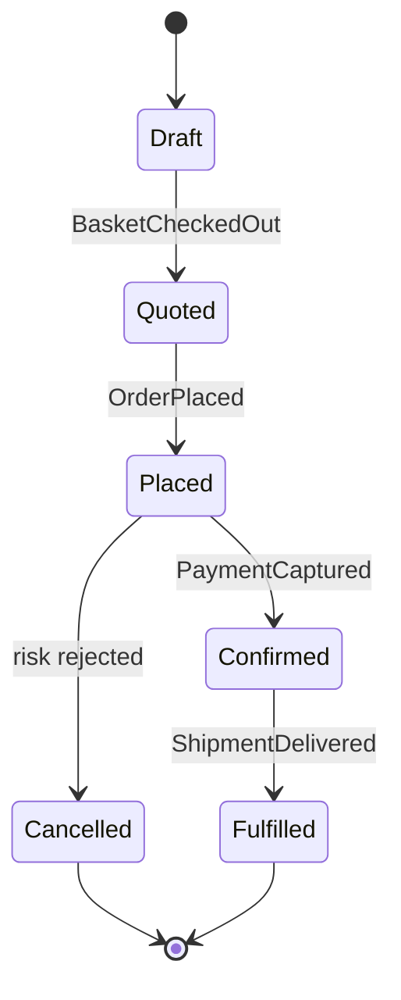

# Order Management

*Generated from the portolan catalog · commit `3 sources` · at 2026-08-29T09:14:22Z. Do not edit by hand.*

- **Id:** `shop.oms`
- **Context:** [Shop](../README.md)
- **Repo:** `github.com/acme/shop`
- **Path:** `services/oms`

## Order Management Service

`shop.oms` owns the lifecycle of a customer order from the moment a basket is
checked out until the order is either fulfilled or cancelled. It is the write
side of the `shop` bounded context and the only service permitted to mutate
order state.

### Responsibilities

- Accept `PlaceOrder` and turn a basket snapshot into an immutable order.
- Coordinate quoting, authorisation and dispatch without owning any of them.
- Publish domain events describing what happened, never what should happen next.

### Non-responsibilities

Pricing rules live in `shop.pricing`. Money movement lives in
`payments.ledger`. Physical fulfilment lives in `delivery.core`. The OMS
holds no schedule, no price list and no ledger balance.

### Order lifecycle

### Aggregates

| Aggregate | Root entity   | Events | Notes                                   |
| --------- | ------------- | ------ | --------------------------------------- |
| `order`   | `Order`       | 3      | Transactional boundary for one order.   |
| `basket`  | `Basket`      | 1      | Short lived; expires after 24h.         |

### Consistency

Every command runs inside a single database transaction that also appends to the
outbox table. The relay publishes to the bus at least once, so all consumers must
be idempotent on `event_id`.

### Operational notes

- Read replicas serve `GetOrder`; expect up to 400ms of replication lag.
- The fraud scoring call is best-effort and fails open after 250ms.

## Aggregates

| Aggregate | Root | Commands | Queries | Events |
| --- | --- | --- | --- | --- |
| [Order](aggregates/order.md) | `Order` | 3 commands | 2 queries | 3 events |

## Provides

**`shop.v1.Orders`** — `proto/shop/v1/orders.proto:12`

- `PlaceOrder`
- `GetOrder`
- `CancelOrder`
- `ConfirmOrder`

PlaceOrderRequest

| Field | Type | Doc |
| --- | --- | --- |
| `customer` | [`CustomerRef`](../../types.md#customerref) | Who is placing the order. |
| `items` | [`LineItem`](../../types.md#lineitem) | Basket contents at checkout. |
| `shipTo` | [`Address`](../../types.md#address) | Delivery address. |

PlaceOrderResponse

| Field | Type | Doc |
| --- | --- | --- |
| `orderId` | `string` | Id of the order just created. |
| `total` | [`Money`](../../types.md#money) | Total charged. |

## Consumes

| Call | Peer | Status | Source | Note |
| --- | --- | --- | --- | --- |
| `shop.v1.Pricing/GetQuote` | [shop.pricing](../pricing/README.md) | verified | `internal/oms/client/pricing.go:34` | — |
| `payments.v1.Payments/Authorize` | [payments.ledger](../../payments/ledger/README.md) | verified | `internal/oms/client/payments.go:51` | Covered end to end by services/oms/test/integration/order_accepted_test.go. |
| `payments.v1.Payments/Capture` | [payments.ledger](../../payments/ledger/README.md) | declared | `internal/oms/client/payments.go:78` | — |
| `payments.v1.Payments/Refund` | [payments.ledger](../../payments/ledger/README.md) | declared | `internal/oms/client/payments.go:104` | — |
| `fraud.v2.Scoring/Score` | `fraud-scoring` | unresolved | `internal/oms/client/fraud.go:22` | No service in the catalog provides fraud.v2.Scoring. The target is configured per environment via FRAUD_ADDR. |
| `delivery.v1.Delivery/GetShipment` | [delivery.core](../../delivery/core/README.md) | declared | `internal/oms/client/delivery.go:41` | — |

## Publishes

| Event | Latest | Consumers |
| --- | --- | --- |
| [OrderPlaced](aggregates/order.md) | v2 | [payments.ledger](../../payments/ledger/README.md), [shop.pricing (declared)](../pricing/README.md), `analytics-sink (unresolved)` |
| [OrderConfirmed](aggregates/order.md) | v1 | [delivery.core](../../delivery/core/README.md) |
| [OrderCancelled](aggregates/order.md) | v1 | [payments.ledger](../../payments/ledger/README.md), [delivery.core (declared)](../../delivery/core/README.md) |

## Stores

| Store | Kind | Access | Tables |
| --- | --- | --- | --- |
| [Order management database](stores/pg.md) | postgres | owns | 4 tables |

## Decisions

| ADR | Title | Status | Date |
| --- | --- | --- | --- |
| [shop.oms.0007](../../adr/shop.oms.0007.md) | Cart reads go through CartRepository, not Temporal Queries | accepted | 2026-04-23 |
| [shop.oms.0003](../../adr/shop.oms.0003.md) | Read cart state via Temporal QueryWorkflow | superseded | 2025-06-18 |
