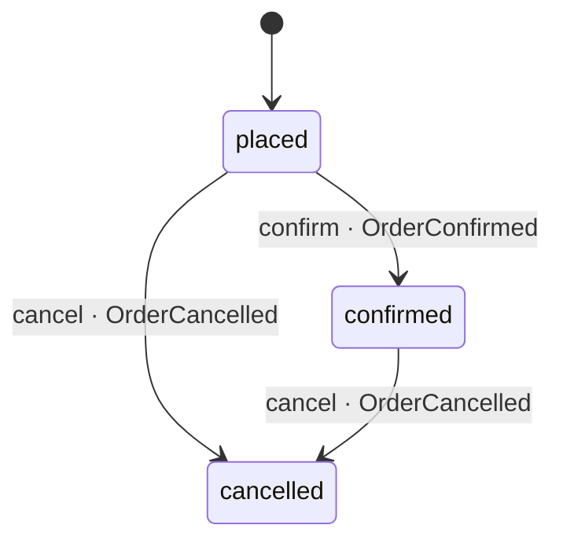
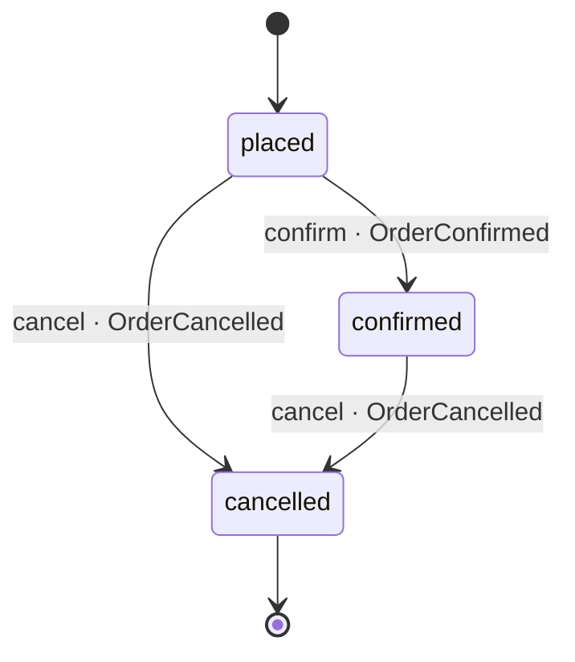

# Order

*Generated from the portolan catalog · commit `6 sources` · at 2026-08-29T09:14:22Z. Do not edit by hand.*

- **Id:** `shop.oms.order`
- **Service:** [Order Management](../README.md)
- **Root:** `Order`

What a basket became at checkout: the lines and the total the customer agreed
to, copied and never repriced, under one lock. An order is placed from a
`BasketCheckedOut`, not by anyone calling in; it is confirmed when the payment
is authorised, and cancelled by the customer while the parcel has not moved,
or by a declined payment.

The moves are one table, `TRANSITIONS` in `status.rs`, and one method makes
them, `move_to`: an edge the table lacks is refused before anything else
happens. Fulfilled is not a state yet - nothing in the estate delivers - and
will arrive with the service that does.

## Entities

### Order — aggregate root

The root. Everything about an order changes through a method here, and
every method that changes something hands back the event that says so:
the caller records both in one transaction, or neither.

| Field | Type | Doc |
| --- | --- | --- |
| `id` | `String` | — |
| `customer_id` | `String` | — |
| `basket_id` | `String` | — |
| `lines` | `Vec<Line>` | — |
| `total` | `Money` | — |
| `status` | `Status` | — |
| `placed_at` | `DateTime<Utc>` | — |
| `version` | `u32` | Bumped on every save; a save from a stale read is refused (Error::Conflict). |

### Line

One line of the order: a SKU, how many, and the price it was added to the
basket at. The price is copied from the basket and never recomputed (ADR
oms.0003); the customer agreed to this number.

| Field | Type |
| --- | --- |
| `sku` | `String` |
| `quantity` | `u32` |
| `unit_price` | `Money` |

## Value objects

### Money

An amount in the minor unit of a currency: 1999 EUR is 19.99. The currency
is three upper-case letters and nothing checks it further; the order only
requires every line to agree with the total on it.

| Field | Type |
| --- | --- |
| `amount_minor` | `i64` |
| `currency` | `String` |

## Lifecycle

| From | To | On | Emits | Source |
| --- | --- | --- | --- | --- |
| `placed` | `confirmed` | `confirm` | `OrderConfirmed` | `examples/shop/oms/src/domain/order/order.rs:65` |
| `placed` | `cancelled` | `cancel` | `OrderCancelled` | `examples/shop/oms/src/domain/order/order.rs:76` |
| `confirmed` | `cancelled` | `cancel` | `OrderCancelled` | `examples/shop/oms/src/domain/order/order.rs:76` |

## Operations

| Operation | Kind | Exposed by | Doc |
| --- | --- | --- | --- |
| `CancelOrder` | command | `CancelOrder` | Cancels an order that has not been dispatched, and says so with `OrderCancelled`. Cancelling twice is not an error: the second call finds a cancelled order and changes nothing. |
| `ConfirmOrder` | command | *internal* | Confirms a placed order once its total is authorised with payments, and says so with `OrderConfirmed`. Payments is asked synchronously, because the answer is what decides; no service in the estate provides `payments.v1` yet, so the call is a stand-in until one does (ADR oms.0005). |
| `GetOrder` | query | `CancelOrder`, `GetOrder` | Answers with the order as it is now; a cancelled order is still found. |
| `PlaceOrder` | command | *internal* | Places an order from a checked-out basket, once: a second `BasketCheckedOut` for the same basket places nothing and answers with the order already there. The lines and the total are the basket's, copied and never repriced. |

## Events

### OrderCancelled

`shop.oms.order.OrderCancelled`

On the wire as `oms.OrderCancelled`, on `shop.oms.order`.

#### v1 — current

The order will not be fulfilled. The reason says whether the customer
asked or the payment was declined, because a consumer unwinds them
differently: a hold is voided, a capture is refunded.

Source: `examples/shop/oms/src/domain/order/event/order_cancelled.rs`

| Field | Type |
| --- | --- |
| `order_id` | `String` |
| `reason` | `String` |
| `occurred_at` | `DateTime<Utc>` |

### OrderConfirmed

`shop.oms.order.OrderConfirmed`

On the wire as `oms.OrderConfirmed`, on `shop.oms.order`.

#### v1 — current

The payment is authorised and the order may be fulfilled. Whoever ships
listens for this.

Source: `examples/shop/oms/src/domain/order/event/order_confirmed.rs`

| Field | Type |
| --- | --- |
| `order_id` | `String` |
| `authorization_id` | `String` |
| `occurred_at` | `DateTime<Utc>` |

### OrderPlaced

`shop.oms.order.OrderPlaced`

On the wire as `oms.OrderPlaced`, on `shop.oms.order`.

#### v1 — current

An order came into being from a checked-out basket. Placed, not yet paid
for: whoever moves money listens for this.

Source: `examples/shop/oms/src/domain/order/event/order_placed.rs`

| Field | Type |
| --- | --- |
| `order_id` | `String` |
| `basket_id` | `String` |
| `customer_id` | `String` |
| `total` | `Money` |
| `occurred_at` | `DateTime<Utc>` |
