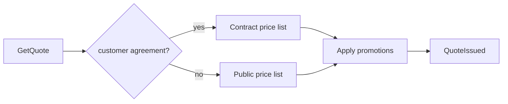

# Pricing

*Generated from the portolan catalog · commit `2 sources` · at 2026-08-29T09:14:22Z. Do not edit by hand.*

- **Id:** `shop.pricing`
- **Context:** [Shop](../README.md)
- **Repo:** `github.com/acme/shop`
- **Path:** `services/pricing`

## Pricing Service

`shop.pricing` answers one question: what should this basket cost for this
customer, right now. It is a pure read model over price lists, promotions and
customer agreements. It never writes order state.

### Design

Quotes are immutable and time-boxed. A quote is issued with an explicit
expiry; the OMS must re-quote rather than reuse an expired one. This keeps
pricing decisions auditable long after the price list has changed.

### Price list precedence

| Rank | Source              | Scope             | Overrides            |
| ---- | ------------------- | ----------------- | -------------------- |
| 1    | Contract price list | One customer      | Everything below     |
| 2    | Regional list       | One country       | Public list          |
| 3    | Public list         | Everyone          | Nothing              |

Promotions are applied after precedence is resolved and are never stacked more
than two deep.

### Aggregates

- `quote` — an issued quote and its expiry. Emits `QuoteIssued` and
  `QuoteExpired`.
- `price-list` — the price list itself. It is edited through an internal admin
  tool that writes directly to the store, so this aggregate currently publishes
  no domain events. That is a known gap, not a design choice.

### Caching

Quotes are cached for 60 seconds keyed by basket hash and customer segment. The
cache is deliberately short: a stale quote is worse than a slow one.

## Aggregates

| Aggregate | Root | Commands | Queries | Events |
| --- | --- | --- | --- | --- |
| [Quote](aggregates/quote.md) | `Quote` | 2 commands | 1 query | 2 events |
| [PriceList](aggregates/price-list.md) | `PriceList` | 2 commands | 1 query | 0 events |

## Provides

**`shop.v1.Pricing`** — `proto/shop/v1/pricing.proto:9`

- `GetQuote`
- `ListPriceLists`

GetQuoteRequest

| Field | Type | Doc |
| --- | --- | --- |
| `items` | [`LineItem`](../../types.md#lineitem) | Lines to price. |
| `customer` | [`CustomerRef`](../../types.md#customerref) | Segment drives the discount. |

GetQuoteResponse

| Field | Type | Doc |
| --- | --- | --- |
| `quoteId` | `string` | Quote id, to be echoed at checkout. |
| `total` | [`Money`](../../types.md#money) | Quoted total. |

## Consumes

| Call | Peer | Status | Source |
| --- | --- | --- | --- |
| `shop.v1.Orders/GetOrder` | [shop.oms](../oms/README.md) | verified | `internal/pricing/client/orders.go:19` |

## Publishes

| Event | Latest | Consumers |
| --- | --- | --- |
| [QuoteIssued](aggregates/quote.md) | v1 | [shop.oms](../oms/README.md) |
| [QuoteExpired](aggregates/quote.md) | v1 | [shop.oms (declared)](../oms/README.md) |

## Stores

| Store | Kind | Access | Tables |
| --- | --- | --- | --- |
| [Price list cache](stores/cache.md) | redis | owns | 0 tables |
| [Order management database](../oms/stores/pg.md) | postgres | reads | 5 tables |
