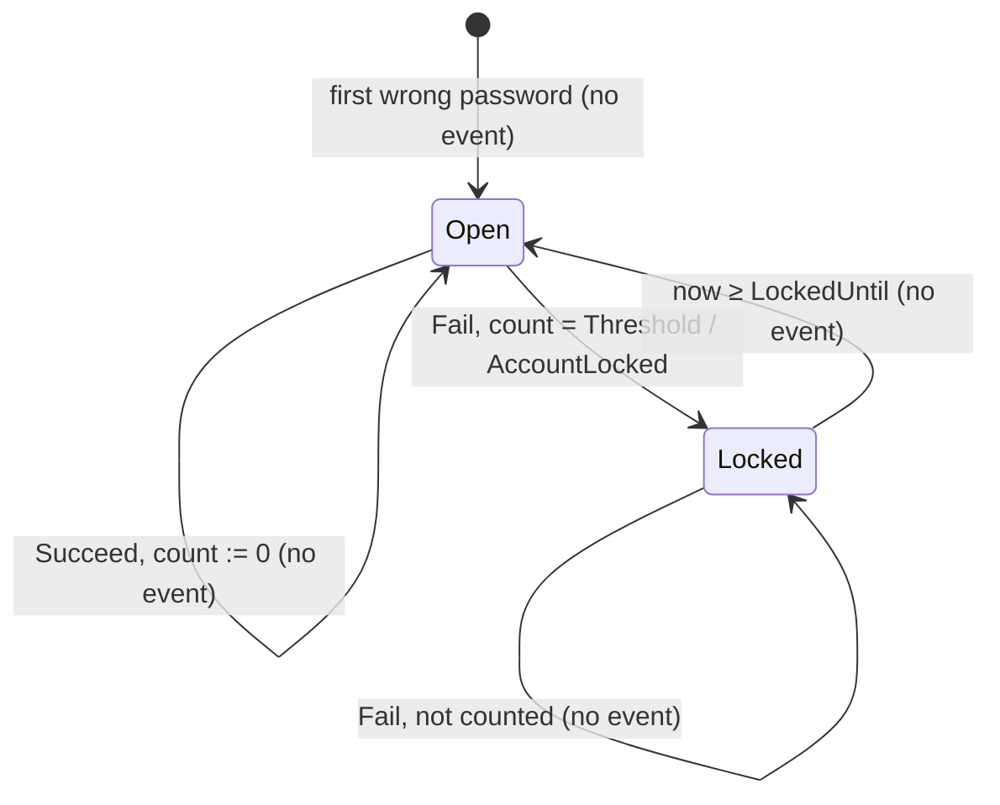

# Lockout

How many wrong passwords in a row an account has taken, and whether it is
refusing logins because of them. One per user, identified by the user id,
existing from the first wrong password on. A separate aggregate from `User`:
a failed attempt is written on every wrong password and the user does not
change when one arrives, so the two do not share a lock.

## States

- **Open** — counting. `Failures` is the number of wrong passwords in a row;
  the account accepts a password. The only state a password is checked in.
- **Locked** — until `LockedUntil`. The account refuses a password without
  checking it, with the same answer a wrong one gets. Not terminal: it ends
  by time.
- A lock that has run out is **Open** again. Derived from time when the next
  attempt arrives; no command, no event, nothing runs. The next wrong
  password starts the count at one.

The state is read off `LockedUntil` with `now`; there is no stored flag to
drift from it.

## Commands

| Command | From | To | Event |
|---|---|---|---|
| `New` | — | Open, zero failures | none; nothing has happened yet |
| `Fail` | Open, count < Threshold − 1 | Open, count + 1 | none |
| `Fail` | Open, count = Threshold − 1 | Locked | `AccountLocked` |
| `Fail` | Locked | unchanged | none; reports "locked nothing" |
| `Succeed` | Open | Open, count 0 | none; reports whether anything changed |
| `Succeed` | Locked | unchanged | none; the lock stands |

`Allows(now)` and `Locked(now)` are the read, for the caller that asks
before checking a password.

One event for the whole aggregate. A wrong password that locked nothing is a
count, not a fact anybody consumes; a count going back to zero is
bookkeeping; the lock running out is time passing. `AccountLocked` carries
`Until`, so a consumer who wants to know when the account is usable again
does not have to be told twice.
