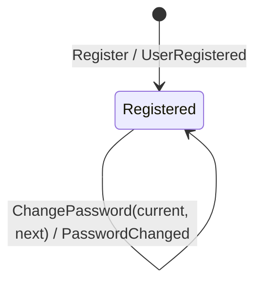

# User

A person, the address they log in with, and the hash of the password they log
in by. Identity is the id, minted at registration; the address can change.

## States

One state. A user that exists is registered, and nothing here ends that:
there is no deletion, no suspension, no lockout. Each of those is a real
requirement somewhere and none of them is here.

`ChangePassword` changes a value, not a state. It is a command with a guard
(the current password) and an event, and the user is the same user afterwards.

## Commands

| Command | Guard | Event |
|---|---|---|
| `Register` | address and password pass their policies | `UserRegistered` |
| `ChangePassword` | the current password matches; the new one passes the policy | `PasswordChanged` |
| `Authenticate` | — | none; a read that answers one refusal for every failure |

No command here touches a session. That a password change ends sessions is a
rule about sessions, applied by the policy in `internal/application/policy`.
