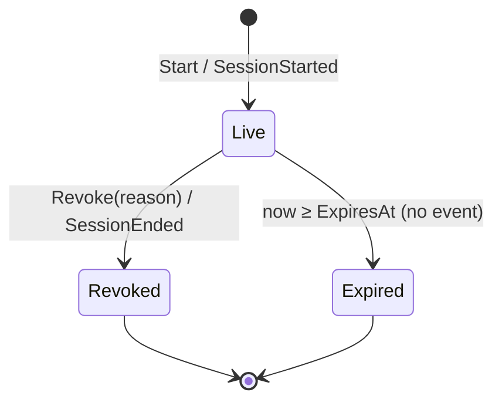

# Session

Proof that a user logged in, how long that proof is good for, and whether it
has been taken away. A separate aggregate from `User`: it is written far more
often and revoked without the user changing, so the two do not share a lock.
They are linked by user id and nothing else.

## States

- **Live** — issued, not revoked, not past expiry. The only state a token is
  accepted in.
- **Revoked** — ended by a command, with a reason. Terminal: a revoked session
  never comes back, logging in again produces a new one.
- **Expired** — past `ExpiresAt`. Derived from time when the token is
  presented; no command, no event, nothing runs. Every consumer already knows
  the expiry from `SessionStarted`.

The state is not stored as a field. It is read off `RevokedAt` and
`ExpiresAt` with `now`, so there is no second copy to drift. The moves are
one table, `Rules` in `rules.go`, run through `go-sdk/fsm` by `trigger`; a
command that would move the session somewhere the table does not allow is
refused there, which is what makes `Revoke` idempotent. Expiry is not in the
table: it is not a move, nothing runs when it happens.

## Commands

| Command | From | To | Event |
|---|---|---|---|
| `Start` | — | Live | `SessionStarted` |
| `Revoke(reason)` | Live | Revoked | `SessionEnded` |
| `Revoke(reason)` | Revoked, Expired | unchanged | none; reports "nothing to do" |

`Validate(now)` is the read: it says which state forbids use (`ErrRevoked`,
`ErrExpired`) or nothing. `Live(now)` is the same question as a boolean.

Revoking twice is the "nothing to do" answer, not a refusal: the caller asked
for something already true. Ending it again would publish a `SessionEnded`
for an ending that did not happen.

## Token lifecycle

Login creates one session and one 32-byte random, base64url-encoded opaque
token. There is no refresh token and no rotation endpoint. The token contains
no claims: validation always resolves server-side state, through the optional
cache in front of the repository, and then checks revocation and expiry.

The current persistence shape stores the token so existing deployments and
API behaviour remain unchanged. Logout and security policies revoke the
session; expiry is derived at validation time after 24 hours and emits no
event. A new login always creates a new session and token.
