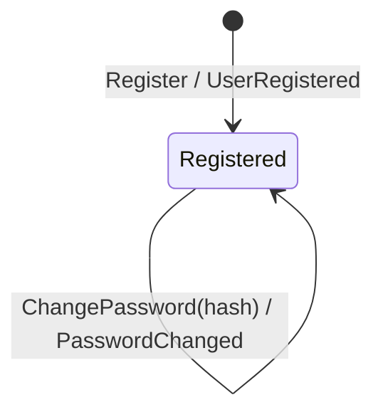

# User

A person, the address they log in with, and the opaque hash of the password
they log in by. Identity is the id, minted at registration.

## States

One state. A user that exists is registered, and nothing here ends that:
there is no deletion, no suspension, no lockout. Each of those is a real
requirement somewhere and none of them is here.

`ChangePassword` changes a value, not a state. Credential verification and
hashing happen in application services through consumer-owned password ports;
the aggregate accepts only an already-produced hash and never sees plaintext.

## Commands

| Command | Guard | Event |
|---|---|---|
| `Register` | valid address and a non-empty password hash | `UserRegistered` |
| `ChangePassword` | non-empty password hash | `PasswordChanged` |

`check_credentials` is an application use case because it coordinates repository
lookup, lockout and password verification. It is intentionally not an
aggregate method and never issues a session; `session/application/login`
depends on it through its own `Authenticator` port.

No command here touches a session. That a password change ends sessions is a
rule about sessions, applied by the policy in `internal/session/infrastructure/messaging/policy`.
