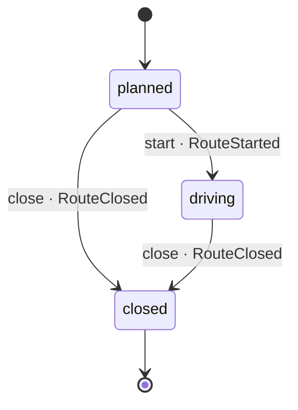

One van, one day, in the order the stops are driven.

The order is the route: changing it is planning another one rather than editing
this. A stop knows which shipment it is dropping, and carries the address it
was planned against - a copy of the shipment's, which is itself a copy of the
order's.

## States

- **planned** - the day exists; where every route starts.
- **driving** - the van is out.
- **closed** - the day is over, whatever was left undone. Terminal. A
  planned day can be closed without ever being driven: that is a cancelled
  day, and the same event says so with every stop undone.

## Transitions

A stop being done is not a state of the route: it is a fact about the stop,
and the route reads it when it closes.
