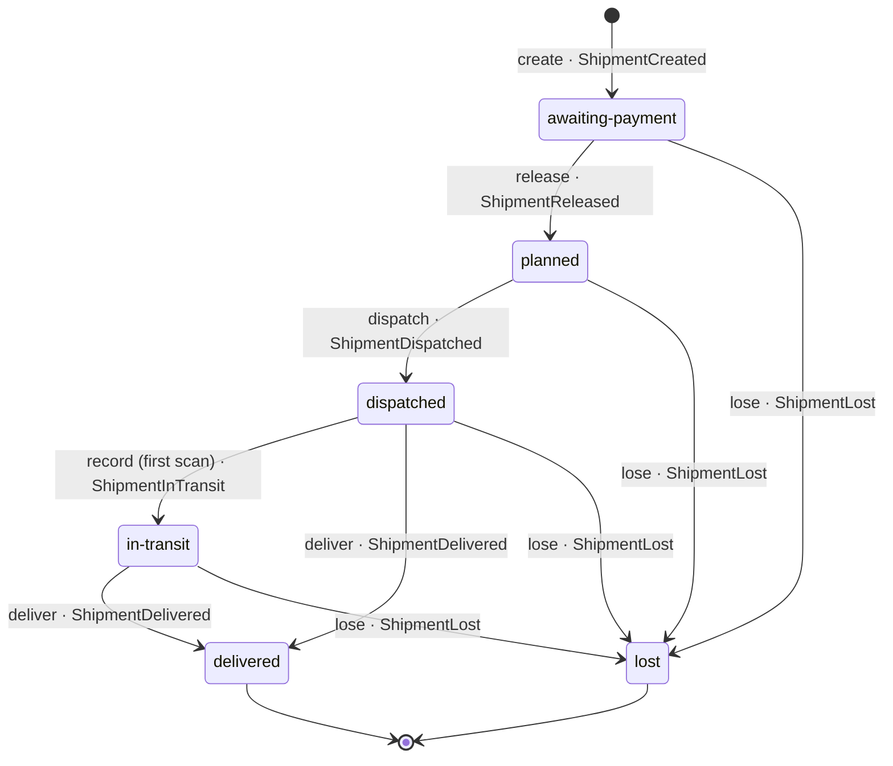

What is being carried to one address for one order.

A shipment is created when the order is confirmed, waits for the money, is
released when the ledger says it moved,
is planned onto a route, dispatched with a tracking code, seen a few times on
the way, and then either delivered or written off. The address is a copy taken
from the order at dispatch, not a reference: a parcel already on a van does not
move because somebody edited their profile - and that copy is the one thing
here that another service's schema can be seen in.

Created from a confirmed order, a shipment has no parcels and no address:
nobody in the estate hands those over at confirmation. It may wait for the
money like that, but it is not planned onto a route without an address, and
it is not dispatched with no parcels (ADR core.0003).

## States

- **awaiting-payment** - where every shipment starts, created when the order
  is confirmed. Nothing leaves the warehouse before the money has moved (ADR
  core.0002).
- **planned** - released; may be put on a route and handed to the carrier.
- **dispatched** - with the carrier, under a tracking code.
- **in-transit** - seen at least once since dispatch. Later scans add to the
  history and change nothing.
- **delivered** - signed for at the door. Terminal.
- **lost** - written off, with a reason. Terminal; a parcel that turns up
  afterwards is a new shipment.

## Transitions

Every arrow is a command on the root and hands back the event that says so.
`moveTo` is the one way through the table; a move it does not list is refused.
The way in is `create`, which says `ShipmentCreated`.

The catalog draws the same diagram off the code: see the aggregate page.
