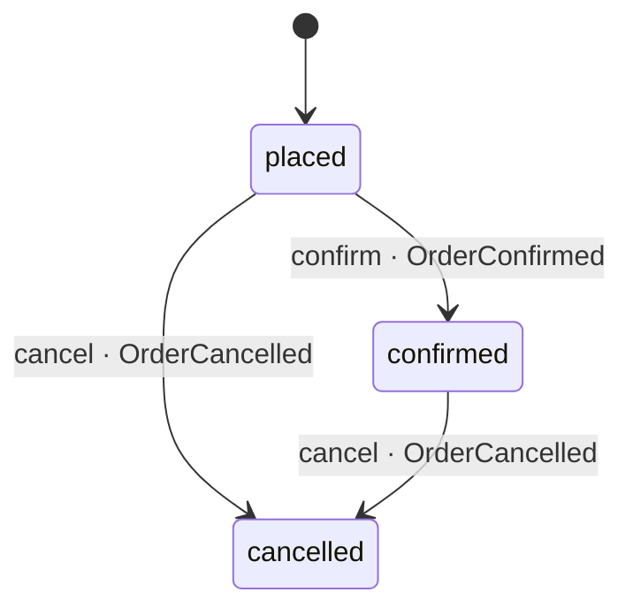

# Order

What a basket became at checkout: the lines and the total the customer agreed
to, copied and never repriced, under one lock. An order is placed from a
`BasketCheckedOut`, not by anyone calling in; it is confirmed when the payment
is authorised, and cancelled by the customer while the parcel has not moved,
or by a declined payment.

The moves are one table, `TRANSITIONS` in `status.rs`, and one method makes
them, `move_to`: an edge the table lacks is refused before anything else
happens. Fulfilled is not a state yet - nothing in the estate delivers - and
will arrive with the service that does.
