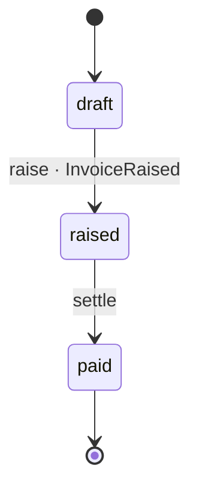

# Invoice

*Generated from the portolan catalog · commit `abc1234` · at 2026-01-02T03:04:05Z. Do not edit by hand.*

- **Id:** `billing.invoices.invoice`
- **Service:** [Invoices](../README.md)
- **Root:** `Invoice`

One invoice, one customer, one currency.

## Entities

### Invoice — aggregate root

The invoice itself.

| Field | Type | Doc |
| --- | --- | --- |
| `id` | `string` | Invoice id. |
| `total` | [`Money`](../../../types.md#type-money) | What is owed. |

## Value objects

### Money

An amount in one currency.

Shared type [`Money`](../../../types.md#type-money).

| Field | Type | Doc |
| --- | --- | --- |
| `amountMinor` | `int64` | Amount in the minor unit. |
| `currency` | `string` | ISO 4217, upper case. |

## Enums

### InvoiceStatus

Where an invoice is in its life.

| Value | Doc |
| --- | --- |
| `DRAFT` | Drawn up, not yet sent. |
| `ISSUED` | Sent to the customer. |
| `VOID` (deprecated) | Withdrawn before payment. |

## Lifecycle

| From | To | On | Emits | Source |
| --- | --- | --- | --- | --- |
| `draft` | `raised` | `raise` | `InvoiceRaised` | `internal/domain/invoice/invoice.go:41` |
| `raised` | `paid` | `settle` | — | `internal/domain/invoice/invoice.go:58` |

## Operations

| Operation | Kind | Doc |
| --- | --- | --- |
| `GetInvoice` | query | — |
| `RaiseInvoice` | command | Raises one. |

## Events

### InvoiceRaised

`billing.invoices.invoice.InvoiceRaised`

On the wire as `billing.InvoiceRaised`, on `billing_invoice`.

| Consumer | Status | Via | Note |
| --- | --- | --- | --- |
| `billing.ledger` | declared | [`flow.raise-invoice#s2`](../../../flows/raise-invoice.md#step-s2) | Not observed. |

#### v1

The original.

Source: `api/events/v1/invoice_raised.proto`

| Field | Type | Doc |
| --- | --- | --- |
| `invoiceId` | `string` | Which invoice. |

#### v2 — current

Adds the total.

Source: `api/events/v2/invoice_raised.proto`

| Field | Type | Doc |
| --- | --- | --- |
| `invoiceId` | `string` | Which invoice. |
| `total` | [`Money`](../../../types.md#type-money) | What is owed. |
