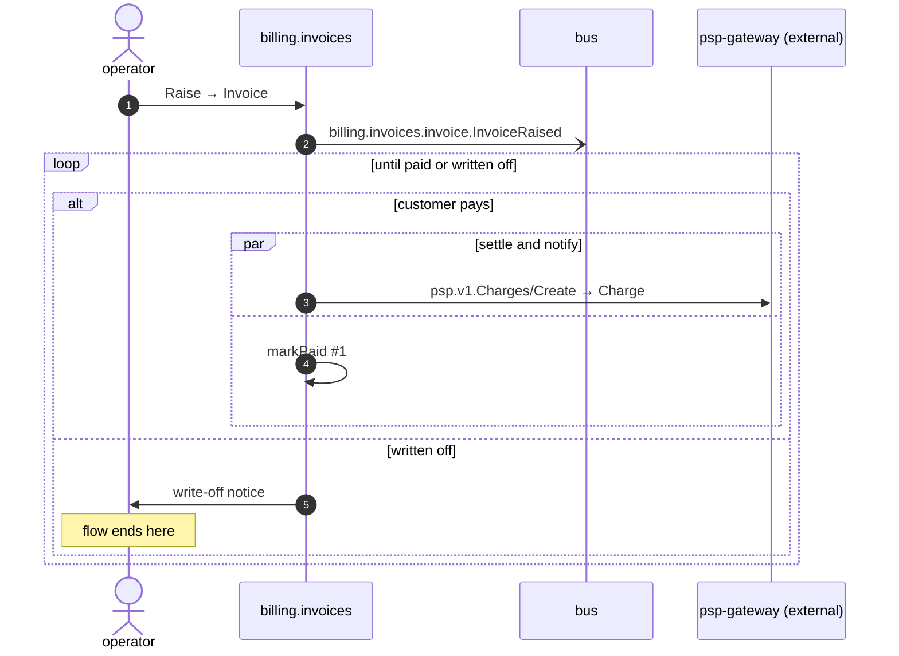

# Raise an invoice

*Generated from the portolan catalog. Do not edit by hand.*

- **Id:** `flow.raise-invoice`
- **Owner:** [billing](../billing/README.md)
- **Source:** `test/e2e/raise_test.go`

An invoice is raised, and paid or written off.

## Participants

| Participant | Kind | Context | Label |
| --- | --- | --- | --- |
| `operator` | actor | — | — |
| `billing.invoices` | service | [billing](../billing/README.md) | — |
| `bus` | broker | — | — |
| `psp-gateway` | external | — | psp-gateway (external) |

## Sequence

## Steps

1. **operator** → **billing.invoices** — Raise → Invoice
   `test/e2e/raise_test.go:31`

2. **billing.invoices** → **bus** — billing.invoices.invoice.InvoiceRaised
   [`billing.invoices.invoice.InvoiceRaised`](../billing/invoices/aggregates/invoice.md#event-billing-invoices-invoice-invoiceraised)

> **Repeats** — until paid or written off
>
>
> > **One of**
> >
> > *customer pays*
> >
> >
> > > **In parallel** — settle and notify
> > >
> > > *Branch 1*
> > >
> > > 
> > > 3. **billing.invoices** → **psp-gateway** — psp.v1.Charges/Create → Charge
> > >    `psp.v1.Charges/Create` · status: declared · The gateway is outside this catalog.
> > >
> > > *Branch 2*
> > >
> > > 
> > > 4. **billing.invoices** ↺ **billing.invoices** — markPaid #1
> >
> >
> > *written off — *ends the flow**
> >
> > 
> > 5. **billing.invoices** → **operator** — write-off notice
> >    status: declared
